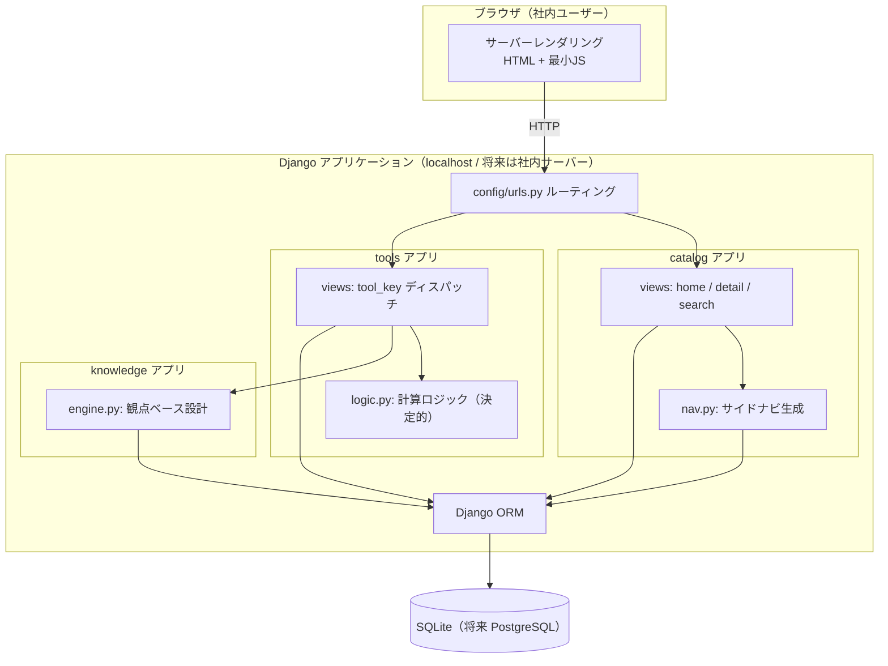
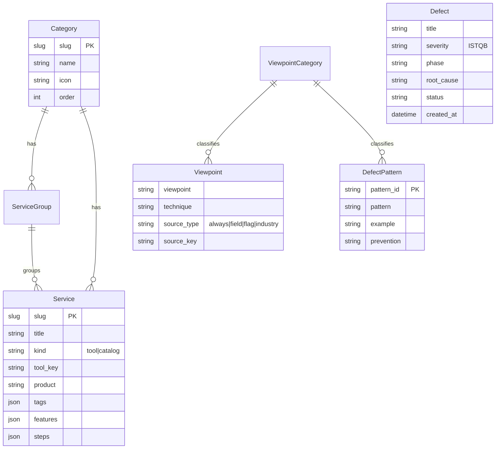
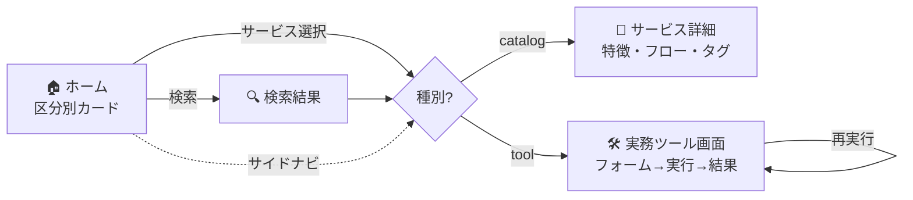
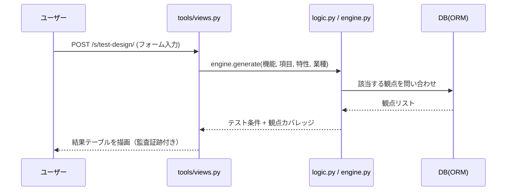

# アーキテクチャ設計書 — ベリサーブ 品質ポータル

本書は社内品質ポータル（Django版）のシステム構成・データモデル・画面遷移を図解する。
図は GitHub 上でグラフィカルに描画される（Mermaid）。

---

## 1. システム構成

**設計の要点**
- 計算ロジック（`logic.py` / `engine.py`）はビューから独立した**純粋関数**。単体テストが容易（QAグレード）。
- 状態は **DB に永続化**（旧版の localStorage 依存を脱却）。複数ユーザー・複数端末で共有可能。
- 画面は**サーバーレンダリング**。JS は最小限（ナビ開閉のみ）でアクセシビリティと保守性を確保。

---

## 2. データモデル（ER図）

- **Service.kind** が `tool` のものは `tool_key` で `tools/views.py` の処理に紐付く。
- **Viewpoint** は適用契機（常時 / 入力項目型 / 機能特性 / 業種）で分類され、観点ベース設計エンジンが参照する。
- **Defect** は ISTQB severity を持ち、DB に保存される（旧版の localStorage から移行）。

---

## 3. 画面遷移

全画面に**パンくず**（区分 › グループ › サービス）と**サイドナビ**を常時表示し、現在位置を明示する。

---

## 4. リクエスト処理フロー（ツール実行時）

---

## 5. 技術選定の理由

| 項目 | 選定 | 理由 |
|---|---|---|
| フレームワーク | Django 5.1 | 認証・DB(ORM)・管理画面が標準装備。社内ポータル/管理システムに最適 |
| DB | SQLite → PostgreSQL | 開発は即起動のSQLite、本番運用時にPostgreSQLへ移行可能 |
| レンダリング | サーバーサイド | SEO/アクセシビリティ/保守性。JSを最小化しQAしやすい |
| 計算ロジック | 純粋関数 | ビューから分離し単体テスト可能。AIなし・決定的で再現性100% |
| コスト | 0円 | すべて無料OSS。外部API・課金・登録なし |
