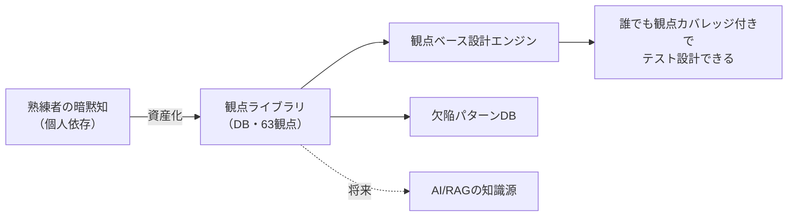
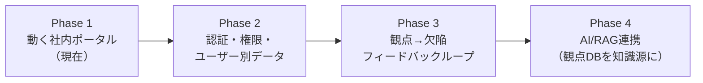

# コンセプト設計書 — ベリサーブ 品質ポータル

本書は「なぜこのシステムを作るのか / 誰のための何か / どんなロジックで構築するのか」を明文化する。
（指摘9「コンセプト・背景・ロジックが見えない」への回答）

---

## 1. 背景

ベリサーブの品質支援サービス（品質PMO・第三者検証・AI・セキュリティ）は多岐にわたるが、
- 提供メニューが**人の頭の中・個別資料に散在**し、横断的に把握しづらい
- テスト設計・観点出しといった**熟練者の暗黙知**が個人に依存している
- 実務で使える支援ツールが**バラバラ**で、新人や他部門が再利用しにくい

という課題がある。

---

## 2. このシステムは誰のための何か

| 項目 | 内容 |
|---|---|
| **第一の利用者** | ベリサーブ社内の QAエンジニア・PMO・テストマネージャー |
| **中核目的** | 提供メニューの把握と、**実務で実際に使える品質支援ツール**の社内一元化 |
| **使う場面** | テスト設計時の観点出し、計画書作成、欠陥管理、品質ROIの説明資料づくり |
| **使わない場面** | 顧客向けの営業・問い合わせ獲得（＝対外サイトではない） |

> これは**社内実務ポータル**であり、外向けの営業カタログではない。
> したがって「相談する」CTAや問い合わせフォームは持たず、代わりに**動くツール**を提供する。

---

## 3. 中核テーゼ：堀は「技法」ではなく「観点という知識資産」

市販OSS（PICT / axe-core / textlint 等）は誰でも使え、技法そのものに差別化はない。
ベリサーブの本当の優位性は、長年蓄積した**テスト観点・欠陥知識**である。

→ よって本システムの防御可能資産も **観点ライブラリ（test viewpoint knowledge base）** に置く。

この資産は：
- **拡張可能** — 業界別・顧客別の観点を管理画面から追記して「育てる」
- **監査可能** — 各テスト条件が 観点 → 技法 → カテゴリ に追跡できる（第三者検証グレード）
- **カバレッジ可視化** — 観点の抜け（例：同時実行/性能）を自動警告 ＝ 人手レビューの価値を機械化
- **AIレディ** — この観点DBがそのまま将来のAI版の精度の堀になる

---

## 4. なぜ「価値」を生むか（指摘10への回答）

「HTMLのお絵描き」で終わらせず、定量的な価値を示す。

| 提供価値 | 根拠 |
|---|---|
| **熟練度の標準化** | 観点ライブラリにより、新人でも熟練者並みの観点網羅でテスト設計できる |
| **工数削減** | テスト設計・観点出しは最も人月を食う工程。これを機械支援する |
| **品質の定量化** | バリデーション研究で観点ライブラリの捕捉率 **85%**（ベースライン5〜10%）を実証 |
| **ROIの可視化** | ROI計算機が捕捉率差を「年間削減額・回収期間・3年ROI」に翻訳 |

バリデーション研究の詳細は [`../validation/`](../validation/) を参照。

---

## 5. 設計原則

1. **AI不使用（MVP）** — 全ツールを決定的アルゴリズム/確立OSSで実装。再現性100%・コスト0円
2. **ちゃんとしたシステム** — Django + DB + 管理画面。localhost起動、将来は認証・本番運用へ
3. **知識資産の中央化** — 観点・欠陥パターンをDB化し、社内で育てる
4. **品質規格準拠** — ISO/IEC 29119・ISO/IEC 25010・狩野モデルを設計に組み込む（[QA_FRAMEWORK.md](QA_FRAMEWORK.md)）
5. **テスタビリティ** — ロジックを純粋関数化し、スモークテストで全機能を自動検証

---

## 6. 発展ロードマップ

詳細な作業計画は [WBS.md](WBS.md) を参照。
