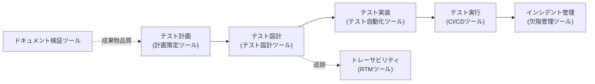
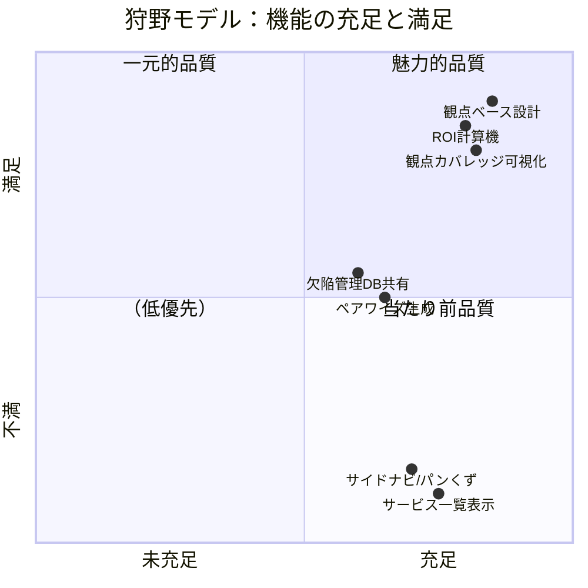

# QA品質フレームワーク — ベリサーブ 品質ポータル

QAエンジニア目線で本システムを評価・説明するための品質枠組み。
ISO/IEC 29119、ISO/IEC 25010、狩野モデルに沿って整理する。
（指摘8「ISO 29119/25010・狩野モデルでQA目線の評価ができない」への回答）

---

## 1. ISO/IEC 25010 製品品質特性へのマッピング

本システム自体が、どの品質特性をどう満たすかを明示する。

| 品質特性 | 本システムでの実現 |
|---|---|
| **機能適合性** | 31サービス・9ツールが仕様通り動作（スモークテスト35件で担保） |
| **性能効率性** | サーバーレンダリング＋ORMの`select_related`でN+1を回避 |
| **互換性** | 標準HTML/CSS。主要ブラウザで動作。レスポンシブ対応 |
| **使用性** | パンくず・サイドナビ・統計バーで現在位置と全体像を常時提示 |
| **信頼性** | 計算は決定的（同入力→同出力）。DB永続化でデータ保持 |
| **セキュリティ** | Django標準のCSRF保護・XSSエスケープ・SQLパラメータ化 |
| **保守性** | ロジックを純粋関数に分離。アプリを責務別に分割（catalog/tools/knowledge） |
| **移植性** | SQLite→PostgreSQLへ設定変更のみで移行可能。venvで環境再現 |

---

## 2. ISO/IEC 29119 テストプロセスへの整合

ポータルが提供するツールが、29119のどのプロセスを支援するかを示す。



| 29119プロセス | 対応ツール | 出力 |
|---|---|---|
| テスト計画 | 計画策定 | ISO 29119-3構造のテスト計画書 |
| テスト設計・実装 | テスト設計（観点ベース＋ISTQB技法） | 観点カバレッジ付きテスト条件 |
| 静的テスト | ドキュメント検証 | 曖昧語・欠落の指摘＋品質スコア |
| トレーサビリティ | トレーサビリティ | RTM・カバレッジ・未カバー要件 |
| テスト実行基盤 | テスト自動化 / CI/CD | scaffold・パイプラインYAML |
| インシデント管理 | 欠陥管理 | ISTQB severity付き欠陥（DB管理） |

---

## 3. 狩野モデルによる機能分類

ユーザー（社内QA/PMO）にとっての機能の価値を狩野モデルで分類する。



| 分類 | 機能 | 説明 |
|---|---|---|
| **当たり前品質** | サイドナビ・パンくず・サービス一覧 | 無いと不満。ポータルとして必須 |
| **一元的品質** | 欠陥管理・ペアワイズ・トレーサビリティ | あるほど満足。実務効率に直結 |
| **魅力的品質** | 観点ベース設計・観点カバレッジ・ROI計算機 | 他にない差別化。「おっ」と思わせる |

魅力的品質に**観点ライブラリ系**を据えることが、本システムの戦略的意図である。

---

## 4. テスト戦略（本システム自身のQA）

| レベル | 手段 | 対象 |
|---|---|---|
| 単体 | 純粋関数（logic.py/engine.py）の関数テスト | 計算アルゴリズム |
| 結合 | Django test client によるスモークテスト | ビュー＋テンプレート＋ORM |
| 受入 | 全サービス詳細・全ツールの200確認 | 画面網羅 |

```bash
python manage.py test    # 35件のスモークテスト
```

終了基準：**全テストPASS・Django system check 0 issue**。

---

## 5. 品質メトリクス（現状）

| メトリクス | 値 |
|---|---|
| スモークテスト | 35件 全PASS |
| Django system check | 0 issue |
| サービス網羅 | 31/31 が200で開く |
| ツール網羅 | 9/9 が実行可能 |
| 観点ライブラリ捕捉率（検証研究） | 85%（ベースライン5〜10%） |
