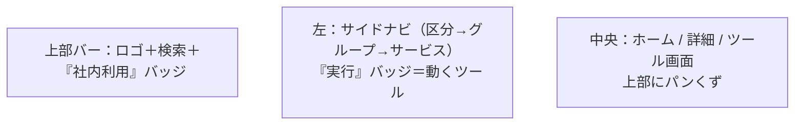

# ユーザーガイド — ベリサーブ 品質ポータル

社内のQAエンジニア・PMO・テストマネージャー向けの利用手引き。
（指摘9「ユーザーガイドがない」への回答）

---

## 1. 起動して開く

```bash
cd QA-PMO/portal
python3 -m venv .venv && source .venv/bin/activate
pip install -r requirements.txt
python manage.py migrate && python manage.py seed_data
python manage.py runserver
```

ブラウザで http://127.0.0.1:8000/ を開く。

---

## 2. 画面の見方



- **サイドナビ**：区分（品質PMO/第三者検証/AIサービス/セキュリティ）をクリックで開閉。
- **「実行」バッジ**が付くサービスは、画面上で実際に動かせる実務ツール。
- **パンくず**：現在の位置（区分 › グループ › サービス）を常に表示。
- **検索**：上部の検索窓にキーワード（例：`GIHOZ`、`ペアワイズ`）を入れると横断検索。

---

## 3. 主なツールの使い方

### テスト設計（観点ベース設計）
1. 機能名を入力（例：ユーザー登録フォーム）
2. 入力項目と型を追加（メール＝email、年齢＝number など）
3. 機能特性（認証あり・金額を扱う 等）にチェック
4. 業種（金融・EC 等）を選ぶと業種特有の観点も適用
5. 「観点ベースで生成」→ **観点カバレッジ%**とテスト条件、未カバー観点の警告が出る

> 各テスト条件は「観点 → 技法 → カテゴリ」に追跡できる（監査証跡）。

### ROI計算機
1. 業種・年間障害件数・1件あたりコスト・現在の手法を入力
2. 「ROIを試算する」→ 年間削減額・回収期間・3年ROIと、捕捉率の比較を表示
3. バリデーション研究（捕捉率85%）を根拠に、品質投資の価値を上司・顧客へ説明できる

### 欠陥管理
- フォームから欠陥を登録（ISTQB severity・フェーズ・根本原因）
- 一覧でステータスを変更（Open→Fixed→Closed）
- **DBに保存**されるため、他のメンバーも同じ欠陥を参照できる
- 「CSVエクスポート」で表計算へ書き出し

### その他のツール
| ツール | 用途 |
|---|---|
| ドキュメント検証 | 要件・設計書の曖昧語/欠落を検出し品質スコア化 |
| トレーサビリティ | 要件とテストの対応表(RTM)・カバレッジを算出 |
| 計画策定 | ISO 29119-3準拠のテスト計画書を生成・DL |
| テスト自動化 | Playwright/pytest/bats のscaffold生成 |
| CI/CD構築 | GitHub Actions のパイプラインYAML生成 |
| 観点ライブラリ | 63観点・欠陥パターン・カバレッジマップを閲覧 |

---

## 4. 管理者向け：知識資産を育てる

観点や欠陥パターンは「育てる」資産です。管理画面から追加・編集できます。

```bash
python manage.py createsuperuser
```

http://127.0.0.1:8000/admin/ にログインし、
- **Viewpoint（テスト観点）**：業種別・顧客別の観点を追記
- **DefectPattern（欠陥パターン）**：現場で見つけた繰り返しバグを登録
- **Service（サービス）**：新サービスの追加・並び替え

追記した観点は、即座にテスト設計ツールの生成結果へ反映されます。

---

## 5. よくある質問

**Q. インターネットや課金は必要？**
A. 不要です。すべてローカル（localhost）・無料OSSで完結します。

**Q. データはどこに保存される？**
A. `portal/db.sqlite3`（SQLite）。本番運用ではPostgreSQL等へ移行できます。

**Q. AIは使っている？**
A. 現状（MVP）はAI不使用。すべて決定的アルゴリズムで再現性100%です。
   将来、観点ライブラリをAIの知識源にする計画です（[WBS.md](WBS.md) Phase 4）。

**Q. 旧版（platform/の静的HTML）との違いは？**
A. 旧版はlocalStorage依存・対外カタログでした。本Django版は社内ポータルとして
   DB永続化・認証対応（予定）・管理画面を備えた本格システムです。
