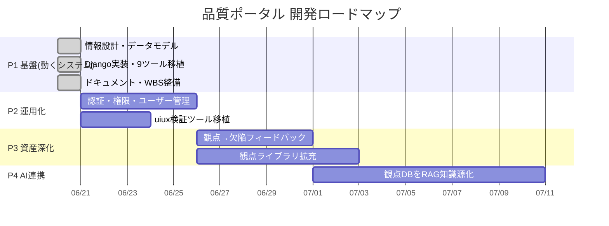

# WBS・開発計画 — ベリサーブ 品質ポータル

「なんとなく作る」を脱し、計画に基づいて開発・管理する。
（指摘11「WBS・計画がなく管理がままならない」への回答）

最終更新: 2026-06-20

---

## 1. 指摘11項目 → 対応マッピング

ご指摘いただいた改善点を、すべて作業項目に紐付けて管理する。

| # | 指摘 | 対応方針 | フェーズ | 状態 |
|---|---|---|---|---|
| 1 | サイドメニューに必要なものがない／上司依頼の表示がない | 4区分31サービスをDB化しナビ再構築 | P1 | ✅完了 |
| 2 | 「サービスメニュー」が意味不明／TOPページがない | ホーム(TOP)を新設、区分別カード配置 | P1 | ✅完了 |
| 3 | Web上で動作させられない | Djangoで9ツールをサーバー実行化 | P1 | ✅完了 |
| 4 | デザインが最適化されていない | デザインシステム適用・レスポンシブ化 | P1 | ✅完了 |
| 5 | パンくずがなくUI/UXに寄り添っていない | 全画面にパンくず＋サイドナビ常設 | P1 | ✅完了 |
| 6 | 対外向けで社員利用を想定していない | 社内ポータルへ転換（CTA除去・DB共有） | P1 | ✅完了 |
| 7 | UML/図がなくグラフィカルでない | Mermaidでアーキ図・ER図・遷移図を整備 | P1 | ✅完了 |
| 8 | ISO29119/25010・狩野でQA評価できない | QA_FRAMEWORK.md で枠組みを明文化 | P1 | ✅完了 |
| 9 | コンセプト・背景・ロジックが見えない | CONCEPT.md・USER_GUIDE.md を整備 | P1 | ✅完了 |
| 10 | 価値を提供できていない | ROI試算・観点カバレッジで定量価値を提示 | P1 | ✅完了 |
| 11 | WBS・計画がなく管理できない | 本WBSを整備し以後これで管理 | P1 | ✅完了 |

---

## 2. フェーズ計画（全体像）

---

## 3. WBS（作業分解）

### Phase 1：基盤＝localhostで動く社内システム ✅完了

| WBS | 作業 | 成果物 | 状態 |
|---|---|---|---|
| 1.1 | 技術選定（Django確定） | 意思決定記録 | ✅ |
| 1.2 | データモデル設計 | catalog/knowledge/tools models | ✅ |
| 1.3 | 初期データ移植 | seed_data（31サービス・63観点） | ✅ |
| 1.4 | 情報設計・ナビ再構築 | base.html・nav.py | ✅ |
| 1.5 | TOPページ | home.html | ✅ |
| 1.6 | サービス詳細・パンくず | service_detail.html | ✅ |
| 1.7 | 9ツールのロジック移植 | logic.py・engine.py | ✅ |
| 1.8 | 9ツールの画面 | templates/tools/*.html | ✅ |
| 1.9 | 欠陥管理のDB永続化 | Defect model・CRUD | ✅ |
| 1.10 | 管理画面 | admin.py × 3 | ✅ |
| 1.11 | スモークテスト | tools/tests.py（35件PASS） | ✅ |
| 1.12 | 設計ドキュメント | docs/（CONCEPT/ARCH/QA/WBS/GUIDE） | ✅ |

### Phase 1.5：実績OSS活用による強化 ✅完了（PR #13）

「確立済み技術の組み合わせでより良くする」方針（提案A＋B）を実施。

| WBS | 作業 | 成果物 | 状態 |
|---|---|---|---|
| 1.5a | 計算エンジン換装（提案A） | engines.py：textlint/allpairspy/pdfplumber/WeasyPrint＋フォールバック | ✅ |
| 1.5b | ドキュメント検証強化 | textlint文章校正・PDFアップロード入力 | ✅ |
| 1.5c | テスト計画PDF出力 | WeasyPrintでA4整形PDF | ✅ |
| 1.5d | UX刷新（提案B） | HTMX部分更新・Alpine.js・Chart.js（ベンダリング） | ✅ |
| 1.5e | テスト追加 | EngineTest 5件・UxHtmxTest 7件（計35件PASS） | ✅ |

### Phase 2：運用化（次フェーズ・未着手）

| WBS | 作業 | 完了基準 |
|---|---|---|
| 2.1 | ログイン認証 | 社内ユーザーがログインして利用 |
| 2.2 | 権限・ロール | 部門別・役割別のアクセス制御 |
| 2.3 | uiux検証ツール移植 | HTML/WCAG検証をPythonで実装（→32サービス・10ツール） |
| 2.4 | デプロイ | 社内サーバー or クラウドで常時稼働 |

### Phase 3：知識資産の深化（未着手）

| WBS | 作業 | 完了基準 |
|---|---|---|
| 3.1 | 観点→欠陥フィードバック | 登録欠陥から新観点を提案 |
| 3.2 | 観点ライブラリ拡充 | 業種・顧客別観点の追加運用 |

### Phase 4：AI連携（未着手）

| WBS | 作業 | 完了基準 |
|---|---|---|
| 4.1 | 観点DBのRAG化 | AI版テスト設計の知識源として接続 |

---

## 4. 完了の定義（Definition of Done）

各フェーズは以下を満たして完了とする。

- [ ] `python manage.py test` が全PASS
- [ ] `python manage.py check` が 0 issue
- [ ] 対象機能が localhost で実際に動作する
- [ ] 設計・利用ドキュメントが更新されている
- [ ] mainブランチへマージ済み

---

## 5. リスクと前提

| 項目 | 内容 |
|---|---|
| 制約 | 課金0円・外部登録なし・セキュリティ規約遵守（全てOSSローカル完結） |
| 前提 | 当面はlocalhost。本番運用はPhase2の認証・デプロイ後 |
| 既知の未対応 | uiux検証ツールはPhase2で移植（現在は他9ツールが稼働） |
