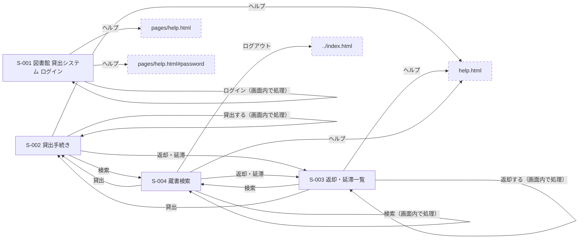

# D03 画面仕様書

## 1. 画面一覧

説明文の欄は LLM 無効のため未生成（業務上の意味は D09-15 で確認） 〔不明（D09-15）〕

| 画面ID | 画面名 | ファイル | 備考 | 説明 | 根拠 |
| --- | --- | --- | --- | --- | --- |
| S-001 | 図書館 貸出システム ログイン | index.html | 正常系 | LLM 無効のため未生成 | 事実（index.html:1） |
| S-002 | 貸出手続き | pages/loan.html | 正常系 | LLM 無効のため未生成 | 事実（pages/loan.html:1） |
| S-003 | 返却・延滞一覧 | pages/returns.html | 正常系 | LLM 無効のため未生成 | 事実（pages/returns.html:1） |
| S-004 | 蔵書検索 | pages/search.html | 正常系 | LLM 無効のため未生成 | 事実（pages/search.html:1） |

## 2. 画面遷移

**画面遷移図** 〔事実（index.html:1, pages/loan.html:1, pages/returns.html:1, pages/search.html:1, index.html:13, index.html:18-36, index.html:35, index.html:37, pages/loan.html:13, pages/loan.html:14, pages/loan.html:15, pages/loan.html:16, pages/loan.html:21-43, pages/loan.html:41, pages/returns.html:13, pages/returns.html:14, pages/returns.html:15, pages/returns.html:16, pages/returns.html:21-37, pages/returns.html:36, pages/search.html:13, pages/search.html:14, pages/search.html:15, pages/search.html:16, pages/search.html:17, pages/search.html:22-49, pages/search.html:48）〕

**画面遷移表**

| 遷移元画面ID | 部品ID | 契機 | 遷移先画面ID | 遷移先の指定 | 根拠 |
| --- | --- | --- | --- | --- | --- |
| S-001 | P-001 | ヘルプ の押下 | （画面外） | pages/help.html | 事実（index.html:13） |
| S-001 | P-002 | login-form のsubmit | 画面内で処理（遷移なし） | —（FN-js_pages_login.js-handleLogin が既定の遷移を止める） | 事実（index.html:18-36, js/pages/login.js:47） |
| S-001 | P-007 | ログイン の押下 | 画面内で処理（遷移なし） | —（FN-js_pages_login.js-handleLogin が既定の遷移を止める） | 事実（index.html:35, js/pages/login.js:47） |
| S-001 | P-008 | ヘルプ の押下 | （画面外） | pages/help.html#password | 事実（index.html:37） |
| S-002 | P-009 | 検索 の押下 | S-004 | search.html | 事実（pages/loan.html:13） |
| S-002 | P-010 | 貸出 の押下 | S-002 | loan.html | 事実（pages/loan.html:14） |
| S-002 | P-011 | 返却・延滞 の押下 | S-003 | returns.html | 事実（pages/loan.html:15） |
| S-002 | P-012 | ヘルプ の押下 | （画面外） | help.html | 事実（pages/loan.html:16） |
| S-002 | P-013 | loan-form のsubmit | 画面内で処理（遷移なし） | —（FN-js_pages_loan.js-handleLoan が既定の遷移を止める） | 事実（pages/loan.html:21-43, js/pages/loan.js:80） |
| S-002 | P-020 | 貸出する の押下 | 画面内で処理（遷移なし） | —（FN-js_pages_loan.js-handleLoan が既定の遷移を止める） | 事実（pages/loan.html:41, js/pages/loan.js:80） |
| S-003 | P-022 | 検索 の押下 | S-004 | search.html | 事実（pages/returns.html:13） |
| S-003 | P-023 | 貸出 の押下 | S-002 | loan.html | 事実（pages/returns.html:14） |
| S-003 | P-024 | 返却・延滞 の押下 | S-003 | returns.html | 事実（pages/returns.html:15） |
| S-003 | P-025 | ヘルプ の押下 | （画面外） | help.html | 事実（pages/returns.html:16） |
| S-003 | P-026 | return-form のsubmit | 画面内で処理（遷移なし） | —（FN-js_pages_returns.js-handleReturn が既定の遷移を止める） | 事実（pages/returns.html:21-37, js/pages/returns.js:69） |
| S-003 | P-031 | 返却する の押下 | 画面内で処理（遷移なし） | —（FN-js_pages_returns.js-handleReturn が既定の遷移を止める） | 事実（pages/returns.html:36, js/pages/returns.js:69） |
| S-004 | P-033 | 検索 の押下 | S-004 | search.html | 事実（pages/search.html:13） |
| S-004 | P-034 | 貸出 の押下 | S-002 | loan.html | 事実（pages/search.html:14） |
| S-004 | P-035 | 返却・延滞 の押下 | S-003 | returns.html | 事実（pages/search.html:15） |
| S-004 | P-036 | ヘルプ の押下 | （画面外） | help.html | 事実（pages/search.html:16） |
| S-004 | P-037 | ログアウト の押下 | （画面外） | ../index.html | 事実（pages/search.html:17） |
| S-004 | P-038 | search-form のsubmit | 画面内で処理（遷移なし） | —（FN-js_pages_search.js-handleSearch が既定の遷移を止める） | 事実（pages/search.html:22-49, js/pages/search.js:75） |
| S-004 | P-044 | 検索 の押下 | 画面内で処理（遷移なし） | —（FN-js_pages_search.js-handleSearch が既定の遷移を止める） | 事実（pages/search.html:48, js/pages/search.js:75） |

## 3. 画面部品表

### S-001 図書館 貸出システム ログイン

| 識別ID | ラベル | 種類 | 識別子 | 制約 | イベント | 説明 | 根拠 |
| --- | --- | --- | --- | --- | --- | --- | --- |
| P-001 | ヘルプ | link | link-help |  |  |  | 事実（index.html:13） |
| P-002 |  | form | login-form |  | submit→FN-js_pages_login.js-handleLogin |  | 事実（index.html:18-36） |
| P-003 | 会員番号 | input | member-id | maxlength=7 minlength=7 pattern=M\\d{6} required=true type=text | input→FN-js_pages_login.js-anonymous-L48 |  | 事実（index.html:21） |
| P-004 | パスワード | input | password | maxlength=32 minlength=8 required=true type=password |  |  | 事実（index.html:26） |
| P-005 | 会員番号を記憶する | input | remember | type=checkbox |  |  | 事実（index.html:30） |
| P-006 |  | output | login-error |  |  |  | 事実（index.html:34） |
| P-007 | ログイン | button | login-submit | type=submit |  |  | 事実（index.html:35） |
| P-008 | ヘルプ | link |  |  |  |  | 事実（index.html:37） |

### S-002 貸出手続き

| 識別ID | ラベル | 種類 | 識別子 | 制約 | イベント | 説明 | 根拠 |
| --- | --- | --- | --- | --- | --- | --- | --- |
| P-009 | 検索 | link |  |  |  |  | 事実（pages/loan.html:13） |
| P-010 | 貸出 | link |  |  |  |  | 事実（pages/loan.html:14） |
| P-011 | 返却・延滞 | link |  |  |  |  | 事実（pages/loan.html:15） |
| P-012 | ヘルプ | link |  |  |  |  | 事実（pages/loan.html:16） |
| P-013 |  | form | loan-form |  | submit→FN-js_pages_loan.js-handleLoan |  | 事実（pages/loan.html:21-43） |
| P-014 | 会員番号 | input | loan-member-id | maxlength=7 pattern=M\\d{6} required=true type=text |  |  | 事実（pages/loan.html:24） |
| P-015 | ISBN（13 桁） | input | loan-isbn | maxlength=13 minlength=13 pattern=\\d{13} required=true type=text |  |  | 事実（pages/loan.html:28） |
| P-016 | 冊数 | input | loan-count | max=5 min=1 required=true step=1 type=number value=1 |  |  | 事実（pages/loan.html:32） |
| P-017 | 貸出日数 | input | loan-days | max=14 min=1 required=true type=number value=14 |  |  | 事実（pages/loan.html:36） |
| P-018 |  | output | loan-error |  |  |  | 事実（pages/loan.html:39） |
| P-019 | 会員を確認 | button | check-member | type=button | click→FN-js_pages_loan.js-handleCheckMember |  | 事実（pages/loan.html:40） |
| P-020 | 貸出する | button | loan-submit | type=submit |  |  | 事実（pages/loan.html:41） |
| P-021 | 下書き保存 | button | loan-save-draft | type=button | click→FN-js_pages_loan.js-anonymous-L82 |  | 事実（pages/loan.html:42） |

### S-003 返却・延滞一覧

| 識別ID | ラベル | 種類 | 識別子 | 制約 | イベント | 説明 | 根拠 |
| --- | --- | --- | --- | --- | --- | --- | --- |
| P-022 | 検索 | link |  |  |  |  | 事実（pages/returns.html:13） |
| P-023 | 貸出 | link |  |  |  |  | 事実（pages/returns.html:14） |
| P-024 | 返却・延滞 | link |  |  |  |  | 事実（pages/returns.html:15） |
| P-025 | ヘルプ | link |  |  |  |  | 事実（pages/returns.html:16） |
| P-026 |  | form | return-form |  | submit→FN-js_pages_returns.js-handleReturn |  | 事実（pages/returns.html:21-37） |
| P-027 | 会員番号 | input | return-member-id | maxlength=7 pattern=M\\d{6} required=true type=text |  |  | 事実（pages/returns.html:24） |
| P-028 | 貸出番号 | input | return-loan-id | maxlength=9 pattern=L\\d{8} required=true type=text |  |  | 事実（pages/returns.html:28） |
| P-029 | 延滞日数 | input | overdue-days | max=365 min=0 type=number value=0 | input→FN-js_pages_returns.js-updateFee |  | 事実（pages/returns.html:32） |
| P-030 |  | output | return-error |  |  |  | 事実（pages/returns.html:35） |
| P-031 | 返却する | button | return-submit | type=submit |  |  | 事実（pages/returns.html:36） |
| P-032 | 一覧を更新 | button | refresh-overdue | type=button | click→FN-js_pages_returns.js-refreshOverdue |  | 事実（pages/returns.html:46） |

### S-004 蔵書検索

| 識別ID | ラベル | 種類 | 識別子 | 制約 | イベント | 説明 | 根拠 |
| --- | --- | --- | --- | --- | --- | --- | --- |
| P-033 | 検索 | link |  |  |  |  | 事実（pages/search.html:13） |
| P-034 | 貸出 | link | link-loan |  |  |  | 事実（pages/search.html:14） |
| P-035 | 返却・延滞 | link | link-returns |  |  |  | 事実（pages/search.html:15） |
| P-036 | ヘルプ | link |  |  |  |  | 事実（pages/search.html:16） |
| P-037 | ログアウト | link | link-logout |  |  |  | 事実（pages/search.html:17） |
| P-038 |  | form | search-form |  | submit→FN-js_pages_search.js-handleSearch |  | 事実（pages/search.html:22-49） |
| P-039 | 検索語 | input | query | maxlength=50 minlength=1 required=true type=search |  |  | 事実（pages/search.html:25） |
| P-040 | 分類 | select | category | options=all,novel,science,history,children |  |  | 事実（pages/search.html:29-35） |
| P-041 | ISBN（13 桁） | input | isbn-filter | maxlength=13 minlength=13 pattern=\\d{13} type=text |  |  | 事実（pages/search.html:39） |
| P-042 | 貸出可能な本だけ | input | available-only | type=checkbox |  |  | 事実（pages/search.html:43） |
| P-043 |  | output | search-error |  |  |  | 事実（pages/search.html:47） |
| P-044 | 検索 | button | search-submit | type=submit |  |  | 事実（pages/search.html:48） |
| P-045 | 履歴を消す | button | clear-recent | type=button | click→FN-js_pages_search.js-anonymous-L76 |  | 事実（pages/search.html:53） |

## 4. 異常系の画面と表示

ソース上に検出なし（抽出した結果 0 件。仕様として存在しないかは D09-164 で確認） 〔不明（D09-164）〕

## 5. 入力項目の範囲・境界

**部品ID は画面部品表と同じ。機能ごとの境界は D02 を参照**

| 部品ID | 対象 | 種類 | 値 | 適用条件 | 境界を含むか | 単位 | 内側の例 | 外側の例 | 値の出所 | 根拠 |
| --- | --- | --- | --- | --- | --- | --- | --- | --- | --- | --- |
| P-003 | 会員番号 | length | 7 | — | 含む | 文字 | 7文字 | 8文字 | 固定値 | 事実（index.html:21） |
| P-003 | 会員番号 | lower | 7 | — | 含む | 文字 | 7文字 | 6文字 | 固定値 | 事実（index.html:21） |
| P-003 | 会員番号 | pattern | M\\d{6} | — | 該当しない |  | M000000 | ! | 固定値 | 事実（index.html:21） |
| P-004 | パスワード | length | 32 | — | 含む | 文字 | 32文字 | 33文字 | 固定値 | 事実（index.html:26） |
| P-004 | パスワード | lower | 8 | — | 含む | 文字 | 8文字 | 7文字 | 固定値 | 事実（index.html:26） |
| P-014 | 会員番号 | length | 7 | — | 含む | 文字 | 7文字 | 8文字 | 固定値 | 事実（pages/loan.html:24） |
| P-014 | 会員番号 | pattern | M\\d{6} | — | 該当しない |  | M000000 | ! | 固定値 | 事実（pages/loan.html:24） |
| P-015 | ISBN（13 桁） | length | 13 | — | 含む | 文字 | 13文字 | 14文字 | 固定値 | 事実（pages/loan.html:28） |
| P-015 | ISBN（13 桁） | lower | 13 | — | 含む | 文字 | 13文字 | 12文字 | 固定値 | 事実（pages/loan.html:28） |
| P-015 | ISBN（13 桁） | pattern | \\d{13} | — | 該当しない |  | 0000000000000 | ! | 固定値 | 事実（pages/loan.html:28） |
| P-016 | 冊数 | upper | 5 | — | 含む | 不明（D09-1） | 5 | 6 | 固定値 | 不明（pages/loan.html:32。D09-1） |
| P-016 | 冊数 | lower | 1 | — | 含む | 不明（D09-1） | 1 | 0 | 固定値 | 不明（pages/loan.html:32。D09-1） |
| P-017 | 貸出日数 | upper | 14 | — | 含む | 不明（D09-1） | 14 | 15 | 固定値 | 不明（pages/loan.html:36。D09-1） |
| P-017 | 貸出日数 | lower | 1 | — | 含む | 不明（D09-1） | 1 | 0 | 固定値 | 不明（pages/loan.html:36。D09-1） |
| P-027 | 会員番号 | length | 7 | — | 含む | 文字 | 7文字 | 8文字 | 固定値 | 事実（pages/returns.html:24） |
| P-027 | 会員番号 | pattern | M\\d{6} | — | 該当しない |  | M000000 | ! | 固定値 | 事実（pages/returns.html:24） |
| P-028 | 貸出番号 | length | 9 | — | 含む | 文字 | 9文字 | 10文字 | 固定値 | 事実（pages/returns.html:28） |
| P-028 | 貸出番号 | pattern | L\\d{8} | — | 該当しない |  | L00000000 | ! | 固定値 | 事実（pages/returns.html:28） |
| P-029 | 延滞日数 | upper | 365 | — | 含む | 不明（D09-2） | 365 | 366 | 固定値 | 不明（pages/returns.html:32。D09-2） |
| P-029 | 延滞日数 | lower | 0 | — | 含む | 不明（D09-2） | 0 | -1 | 固定値 | 不明（pages/returns.html:32。D09-2） |
| P-039 | 検索語 | length | 50 | — | 含む | 文字 | 50文字 | 51文字 | 固定値 | 事実（pages/search.html:25） |
| P-039 | 検索語 | lower | 1 | — | 含む | 文字 | 1文字 | 0文字 | 固定値 | 事実（pages/search.html:25） |
| P-041 | ISBN（13 桁） | length | 13 | — | 含む | 文字 | 13文字 | 14文字 | 固定値 | 事実（pages/search.html:39） |
| P-041 | ISBN（13 桁） | lower | 13 | — | 含む | 文字 | 13文字 | 12文字 | 固定値 | 事実（pages/search.html:39） |
| P-041 | ISBN（13 桁） | pattern | \\d{13} | — | 該当しない |  | 0000000000000 | ! | 固定値 | 事実（pages/search.html:39） |

## 改版履歴

入力元: フォルダ: demo-library 〔事実〕

| 版 | 生成日時 | 入力コミット | 変更箇所 | 根拠 |
| --- | --- | --- | --- | --- |
| 3 | 2026-09-26 17:42（JST） | （なし） | 変更 2 節（1. 画面一覧、4. 異常系の画面と表示）／位置のみ変更 0 節 | 事実 |

| 比較した前回の実行 ID | 前回の生成日時 | 変わった節の数 | 根拠 |
| --- | --- | --- | --- |
| 20260926-062546-b89489 | 2026-09-26 15:25（JST） | 2 | 事実 |

| 前回から変わった節 | 変化 | 根拠 |
| --- | --- | --- |
| 1. 画面一覧 | 変更 | 事実 |
| 4. 異常系の画面と表示 | 変更 | 事実 |
