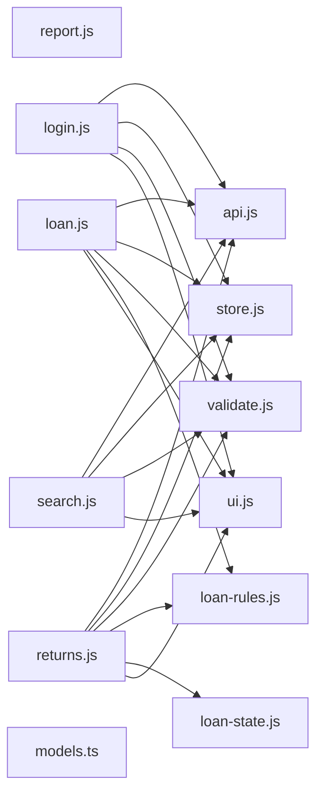

# D11 基本設計書

## システム方式

本書はソースから確定できる事実を記述する。設計の意図・業務上の背景・値の選定理由はソースから復元できないため記述せず、D09（確認事項）に回す。LLM の説明文（推測）はこれらを補うものではない（出典: E. Chikofsky, J. Cross, "Reverse Engineering and Design Recovery: A Taxonomy", IEEE Software, 1990, DOI: 10.1109/52.43044） 〔事実〕

| 項目 | 内容 | 根拠 |
| --- | --- | --- |
| 実行形態 | ブラウザで動く Web アプリ（HTML 画面 4 枚） | 事実（index.html:1, pages/loan.html:1, pages/returns.html:1, pages/search.html:1） |
| 言語 | html 4 件、javascript 11 件、json 1 件、css 1 件、typescript 1 件 | 事実（index.html:1, js/api.js:1, js/legacy/report.js:1, js/loan-rules.js:1, js/loan-state.js:1, js/pages/loan.js:1, js/pages/login.js:1, js/pages/returns.js:1, js/pages/search.js:1, js/store.js:1, js/ui.js:1, js/validate.js:1, package.json:1, pages/loan.html:1, pages/returns.html:1, pages/search.html:1, styles/base.css:1, types/models.ts:1） |
| モジュール方式 | esmodule 10 件、script 1 件、typescript 1 件 | 事実（js/api.js:1, js/legacy/report.js:1, js/loan-rules.js:1, js/loan-state.js:1, js/pages/loan.js:1, js/pages/login.js:1, js/pages/returns.js:1, js/pages/search.js:1, js/store.js:1, js/ui.js:1, js/validate.js:1, types/models.ts:1） |
| データ保持 | D04 参照: DATA-js_store.js-localStorage-session, DATA-js_store.js-localStorage-recentSearches, DATA-js_store.js-localStorage-loanDraft, DATA-types_models.ts-typeAlias-MemberType, DATA-types_models.ts-typeAlias-LoanState, DATA-types_models.ts-interface-Book, DATA-types_models.ts-interface-Member, DATA-types_models.ts-interface-Loan | 事実（js/store.js:8, js/store.js:12, js/store.js:17, js/store.js:23, js/store.js:27, js/store.js:40, js/store.js:45, js/store.js:49, js/store.js:53, js/store.js:58, types/models.ts:3, types/models.ts:4, types/models.ts:6-17, types/models.ts:19-30, types/models.ts:32-42） |
| 外部連携 | 6 件（D05 参照） | 事実（js/api.js:36, js/api.js:77, js/api.js:36, js/api.js:81, js/api.js:36, js/api.js:85, js/api.js:36, js/api.js:89, js/api.js:36, js/api.js:93, js/api.js:36） |
| 依存ライブラリ | 3 件（D06 参照） | 事実（package.json:8, package.json:9, package.json:12） |

## アーキテクチャ

**モジュール依存図** 〔事実（js/api.js:1, js/legacy/report.js:1, js/loan-rules.js:1, js/loan-state.js:1, js/pages/loan.js:1, js/pages/login.js:1, js/pages/returns.js:1, js/pages/search.js:1, js/store.js:1, js/ui.js:1, js/validate.js:1, types/models.ts:1, js/pages/loan.js:1, js/pages/loan.js:2, js/pages/loan.js:3, js/pages/loan.js:4, js/pages/loan.js:5, js/pages/login.js:1, js/pages/login.js:2, js/pages/login.js:3, js/pages/login.js:4, js/pages/returns.js:1, js/pages/returns.js:2, js/pages/returns.js:3, js/pages/returns.js:4, js/pages/returns.js:5, js/pages/returns.js:6, js/pages/search.js:1, js/pages/search.js:2, js/pages/search.js:3, js/pages/search.js:4）〕

図は次を含まない: 動的な呼び出し 2 件・呼び出し元をたどれない関数 8 件（D08『静的解析の限界』） 〔事実〕

**モジュール間の依存**

| モジュールID | 名前 | 依存する内部モジュール | 外部ライブラリ | 根拠 |
| --- | --- | --- | --- | --- |
| MOD-js_api.js | api.js | なし | なし | 事実（js/api.js:1） |
| MOD-js_legacy_report.js | report.js | なし | なし | 事実（js/legacy/report.js:1） |
| MOD-js_loan-rules.js | loan-rules.js | なし | なし | 事実（js/loan-rules.js:1） |
| MOD-js_loan-state.js | loan-state.js | なし | なし | 事実（js/loan-state.js:1） |
| MOD-js_pages_loan.js | loan.js | MOD-js_api.js, MOD-js_store.js, MOD-js_validate.js, MOD-js_loan-rules.js, MOD-js_ui.js | なし | 事実（js/pages/loan.js:1, js/pages/loan.js:2, js/pages/loan.js:3, js/pages/loan.js:4, js/pages/loan.js:5） |
| MOD-js_pages_login.js | login.js | MOD-js_api.js, MOD-js_store.js, MOD-js_validate.js, MOD-js_ui.js | なし | 事実（js/pages/login.js:1, js/pages/login.js:2, js/pages/login.js:3, js/pages/login.js:4） |
| MOD-js_pages_returns.js | returns.js | MOD-js_api.js, MOD-js_store.js, MOD-js_validate.js, MOD-js_loan-rules.js, MOD-js_loan-state.js, MOD-js_ui.js | なし | 事実（js/pages/returns.js:1, js/pages/returns.js:2, js/pages/returns.js:3, js/pages/returns.js:4, js/pages/returns.js:5, js/pages/returns.js:6） |
| MOD-js_pages_search.js | search.js | MOD-js_api.js, MOD-js_store.js, MOD-js_validate.js, MOD-js_ui.js | なし | 事実（js/pages/search.js:1, js/pages/search.js:2, js/pages/search.js:3, js/pages/search.js:4） |
| MOD-js_store.js | store.js | なし | なし | 事実（js/store.js:1） |
| MOD-js_ui.js | ui.js | なし | なし | 事実（js/ui.js:1） |
| MOD-js_validate.js | validate.js | なし | なし | 事実（js/validate.js:1） |
| MOD-types_models.ts | models.ts | なし | なし | 事実（types/models.ts:1） |

## モジュール構成

| モジュールID | 名前 | ファイル | 種類 | 関数数 | クラス数 | export 数 | データ | 根拠 |
| --- | --- | --- | --- | --- | --- | --- | --- | --- |
| MOD-js_api.js | api.js | js/api.js | esmodule | 12 | 1 | 11 | — | 事実（js/api.js:1） |
| MOD-js_legacy_report.js | report.js | js/legacy/report.js | script | 5 | 0 | 0 | — | 事実（js/legacy/report.js:1） |
| MOD-js_loan-rules.js | loan-rules.js | js/loan-rules.js | esmodule | 4 | 0 | 10 | — | 事実（js/loan-rules.js:1） |
| MOD-js_loan-state.js | loan-state.js | js/loan-state.js | esmodule | 4 | 0 | 5 | — | 事実（js/loan-state.js:1） |
| MOD-js_pages_loan.js | loan.js | js/pages/loan.js | esmodule | 5 | 0 | 0 | — | 事実（js/pages/loan.js:1） |
| MOD-js_pages_login.js | login.js | js/pages/login.js | esmodule | 3 | 0 | 0 | — | 事実（js/pages/login.js:1） |
| MOD-js_pages_returns.js | returns.js | js/pages/returns.js | esmodule | 4 | 0 | 0 | — | 事実（js/pages/returns.js:1） |
| MOD-js_pages_search.js | search.js | js/pages/search.js | esmodule | 5 | 0 | 0 | — | 事実（js/pages/search.js:1） |
| MOD-js_store.js | store.js | js/store.js | esmodule | 10 | 0 | 10 | D04 参照: DATA-js_store.js-localStorage-session, DATA-js_store.js-localStorage-recentSearches, DATA-js_store.js-localStorage-loanDraft | 事実（js/store.js:1） |
| MOD-js_ui.js | ui.js | js/ui.js | esmodule | 4 | 0 | 4 | — | 事実（js/ui.js:1） |
| MOD-js_validate.js | validate.js | js/validate.js | esmodule | 9 | 0 | 16 | — | 事実（js/validate.js:1） |
| MOD-types_models.ts | models.ts | types/models.ts | typescript | 0 | 0 | 5 | D04 参照: DATA-types_models.ts-typeAlias-MemberType, DATA-types_models.ts-typeAlias-LoanState, DATA-types_models.ts-interface-Book, DATA-types_models.ts-interface-Member, DATA-types_models.ts-interface-Loan | 事実（types/models.ts:1） |

## 外部 I/F

**内容は D05 の同じ ID を参照**

| 外部I/F ID | 定義 | 呼び出し元モジュール | 根拠 |
| --- | --- | --- | --- |
| INT-js_api.js-fetch-GET-_url_ | D05 INT-js_api.js-fetch-GET-_url_ | MOD-js_api.js | 推測（解析による対応付け。js/api.js:36） |
| INT-js_api.js-fetch-GET-https_api.library.example.jp_v1_books | D05 INT-js_api.js-fetch-GET-https_api.library.example.jp_v1_books | MOD-js_api.js | 推測（解析による対応付け。js/api.js:77, js/api.js:36） |
| INT-js_api.js-fetch-GET-https_api.library.example.jp_v1_members_id_ | D05 INT-js_api.js-fetch-GET-https_api.library.example.jp_v1_members_id_ | MOD-js_api.js | 推測（解析による対応付け。js/api.js:81, js/api.js:36） |
| INT-js_api.js-fetch-POST-https_api.library.example.jp_v1_loans | D05 INT-js_api.js-fetch-POST-https_api.library.example.jp_v1_loans | MOD-js_api.js | 推測（解析による対応付け。js/api.js:85, js/api.js:36） |
| INT-js_api.js-fetch-DELETE-https_api.library.example.jp_v1_loans_id_ | D05 INT-js_api.js-fetch-DELETE-https_api.library.example.jp_v1_loans_id_ | MOD-js_api.js | 推測（解析による対応付け。js/api.js:89, js/api.js:36） |
| INT-js_api.js-fetch-POST-https_api.library.example.jp_v1_sessions | D05 INT-js_api.js-fetch-POST-https_api.library.example.jp_v1_sessions | MOD-js_api.js | 推測（解析による対応付け。js/api.js:93, js/api.js:36） |

## 非機能の実装方式

| 観点 | 実装方式 | 値 | 固定／設定 | 根拠 |
| --- | --- | --- | --- | --- |
| 再試行 | attempt（BND-js_api.js-attempt-retry。連携 INT-js_api.js-fetch-GET-_url_、D05 参照） | 2 回 | コード固定（js/api.js:32, js/api.js:4） | 事実（js/api.js:32, js/api.js:4） |
| 再試行 | attempt（BND-js_api.js-attempt-retry-L38。連携 INT-js_api.js-fetch-GET-_url_、D05 参照） | 2 回 | コード固定（js/api.js:38, js/api.js:4） | 事実（js/api.js:38, js/api.js:4） |
| 再試行 | attempt（BND-js_api.js-attempt-retry-L58。連携 INT-js_api.js-fetch-GET-_url_、D05 参照） | 2 回 | コード固定（js/api.js:58, js/api.js:4） | 事実（js/api.js:58, js/api.js:4） |
| タイムアウト | TIMEOUT_MS（BND-js_api.js-TIMEOUT_MS-timeout。連携 INT-js_api.js-fetch-GET-_url_、D05 参照） | 8000 ms | コード固定（js/api.js:3） | 事実（js/api.js:3） |
| 再試行 | MAX_RETRY（BND-js_api.js-MAX_RETRY-retry。連携 INT-js_api.js-fetch-GET-_url_、D05 参照） | 2 回 | コード固定（js/api.js:4） | 事実（js/api.js:4） |
| 再試行 | RETRY_INTERVAL_MS（BND-js_api.js-RETRY_INTERVAL_MS-retry） | 500 ms | コード固定（js/api.js:5） | 事実（js/api.js:5） |
| 画面幅への対応 | メディアクエリ 2 件 | max-width: 768px、max-width: 480px | コード固定（CSS） | 事実（styles/base.css:95-104, styles/base.css:106-117） |
| エラー処理 | throw 7 件 | — | — | 事実（js/api.js:44, js/api.js:47, js/api.js:50, js/api.js:52, js/api.js:62, js/api.js:69, js/loan-state.js:21） |

## 改版履歴

入力元: フォルダ: demo-library 〔事実〕

| 版 | 生成日時 | 入力コミット | 変更箇所 | 根拠 |
| --- | --- | --- | --- | --- |
| 3 | 2026-09-26 17:42（JST） | （なし） | 変更 3 節（システム方式、アーキテクチャ、モジュール構成）／位置のみ変更 0 節 | 事実 |

| 比較した前回の実行 ID | 前回の生成日時 | 変わった節の数 | 根拠 |
| --- | --- | --- | --- |
| 20260926-062546-b89489 | 2026-09-26 15:25（JST） | 3 | 事実 |

| 前回から変わった節 | 変化 | 根拠 |
| --- | --- | --- |
| システム方式 | 変更 | 事実 |
| アーキテクチャ | 変更 | 事実 |
| モジュール構成 | 変更 | 事実 |
