# D12 詳細設計書

## モジュール一覧

本書はソースから確定できる事実を記述する。設計の意図・業務上の背景・値の選定理由はソースから復元できないため記述せず、D09（確認事項）に回す。LLM の説明文（推測）はこれらを補うものではない（出典: E. Chikofsky, J. Cross, "Reverse Engineering and Design Recovery: A Taxonomy", IEEE Software, 1990, DOI: 10.1109/52.43044） 〔事実〕

| モジュールID | 名前 | ファイル | 種類 | 根拠位置 | 根拠 |
| --- | --- | --- | --- | --- | --- |
| MOD-js_api.js | api.js | js/api.js | esmodule | js/api.js:1 | 事実（js/api.js:1） |
| MOD-js_legacy_report.js | report.js | js/legacy/report.js | script | js/legacy/report.js:1 | 事実（js/legacy/report.js:1） |
| MOD-js_loan-rules.js | loan-rules.js | js/loan-rules.js | esmodule | js/loan-rules.js:1 | 事実（js/loan-rules.js:1） |
| MOD-js_loan-state.js | loan-state.js | js/loan-state.js | esmodule | js/loan-state.js:1 | 事実（js/loan-state.js:1） |
| MOD-js_pages_loan.js | loan.js | js/pages/loan.js | esmodule | js/pages/loan.js:1 | 事実（js/pages/loan.js:1） |
| MOD-js_pages_login.js | login.js | js/pages/login.js | esmodule | js/pages/login.js:1 | 事実（js/pages/login.js:1） |
| MOD-js_pages_returns.js | returns.js | js/pages/returns.js | esmodule | js/pages/returns.js:1 | 事実（js/pages/returns.js:1） |
| MOD-js_pages_search.js | search.js | js/pages/search.js | esmodule | js/pages/search.js:1 | 事実（js/pages/search.js:1） |
| MOD-js_store.js | store.js | js/store.js | esmodule | js/store.js:1 | 事実（js/store.js:1） |
| MOD-js_ui.js | ui.js | js/ui.js | esmodule | js/ui.js:1 | 事実（js/ui.js:1） |
| MOD-js_validate.js | validate.js | js/validate.js | esmodule | js/validate.js:1 | 事実（js/validate.js:1） |
| MOD-types_models.ts | models.ts | types/models.ts | typescript | types/models.ts:1 | 事実（types/models.ts:1） |

## クラス一覧

| クラスID | 名前 | モジュールID | 継承 | メソッド | プロパティ | 根拠位置 | 根拠 |
| --- | --- | --- | --- | --- | --- | --- | --- |
| CLS-js_api.js-ApiError | ApiError | MOD-js_api.js | Error | FN-js_api.js-ApiError.constructor | なし | js/api.js:7-13 | 事実（js/api.js:7-13） |

## 関数一覧と入出力

| 関数ID | 名前 | モジュールID | クラスID | 入力 | 出力 | 同期 | 公開 | 複雑度 | 根拠位置 | 根拠 |
| --- | --- | --- | --- | --- | --- | --- | --- | --- | --- | --- |
| FN-js_api.js-ApiError.constructor | constructor | MOD-js_api.js | CLS-js_api.js-ApiError | status, message | 型注釈なし | 同期 | 内部 | 1 | js/api.js:8-12 | 事実（js/api.js:8-12） |
| FN-js_api.js-withQuery | withQuery | MOD-js_api.js | — | path, query = null | 型注釈なし | 同期 | 内部 | 2 | js/api.js:16-18 | 事実（js/api.js:16-18） |
| FN-js_api.js-wait | wait | MOD-js_api.js | — | ms | 型注釈なし | 同期 | 内部 | 1 | js/api.js:20-22 | 事実（js/api.js:20-22） |
| FN-js_api.js-anonymous-L21 | 無名関数（js/api.js:21） | MOD-js_api.js | — | resolve | 型注釈なし | 同期 | 内部 | 1 | js/api.js:21 | 事実（js/api.js:21） |
| FN-js_api.js-requestWithRetry | requestWithRetry | MOD-js_api.js | — | url, options = {} | 型注釈なし | 非同期 | 公開 | 12 | js/api.js:29-70 | 事実（js/api.js:29-70） |
| FN-js_api.js-anonymous-L34 | 無名関数（js/api.js:34） | MOD-js_api.js | — | なし | 型注釈なし | 同期 | 内部 | 1 | js/api.js:34 | 事実（js/api.js:34） |
| FN-js_api.js-jsonHeaders | jsonHeaders | MOD-js_api.js | — | token | 型注釈なし | 同期 | 内部 | 1 | js/api.js:72-74 | 事実（js/api.js:72-74） |
| FN-js_api.js-searchBooks | searchBooks | MOD-js_api.js | — | query, category, token | 型注釈なし | 同期 | 公開 | 1 | js/api.js:76-78 | 事実（js/api.js:76-78） |
| FN-js_api.js-getMember | getMember | MOD-js_api.js | — | id, token | 型注釈なし | 同期 | 公開 | 1 | js/api.js:80-82 | 事実（js/api.js:80-82） |
| FN-js_api.js-createLoan | createLoan | MOD-js_api.js | — | payload, token | 型注釈なし | 同期 | 公開 | 1 | js/api.js:84-86 | 事実（js/api.js:84-86） |
| FN-js_api.js-deleteLoan | deleteLoan | MOD-js_api.js | — | id, token | 型注釈なし | 同期 | 公開 | 1 | js/api.js:88-90 | 事実（js/api.js:88-90） |
| FN-js_api.js-login | login | MOD-js_api.js | — | memberId, password | 型注釈なし | 同期 | 公開 | 1 | js/api.js:92-94 | 事実（js/api.js:92-94） |
| FN-js_legacy_report.js-exportMonthlyReport | exportMonthlyReport | MOD-js_legacy_report.js | — | loans, month | 型注釈なし | 同期 | 内部 | 1 | js/legacy/report.js:8-14 | 事実（js/legacy/report.js:8-14） |
| FN-js_legacy_report.js-anonymous-L9 | 無名関数（js/legacy/report.js:9） | MOD-js_legacy_report.js | — | l | 型注釈なし | 同期 | 内部 | 1 | js/legacy/report.js:9 | 事実（js/legacy/report.js:9） |
| FN-js_legacy_report.js-anonymous-L12 | 無名関数（js/legacy/report.js:12） | MOD-js_legacy_report.js | — | k | 型注釈なし | 同期 | 内部 | 1 | js/legacy/report.js:12 | 事実（js/legacy/report.js:12） |
| FN-js_legacy_report.js-calcAnnualStats | calcAnnualStats | MOD-js_legacy_report.js | — | loans, startMonth | 型注釈なし | 同期 | 内部 | 20 | js/legacy/report.js:16-56 | 事実（js/legacy/report.js:16-56） |
| FN-js_legacy_report.js-renderReport | renderReport | MOD-js_legacy_report.js | — | format, stats | 型注釈なし | 非同期 | 内部 | 1 | js/legacy/report.js:59-63 | 事実（js/legacy/report.js:59-63） |
| FN-js_loan-rules.js-loanLimit | loanLimit | MOD-js_loan-rules.js | — | memberType | 型注釈なし | 同期 | 公開 | 4 | js/loan-rules.js:9-20 | 事実（js/loan-rules.js:9-20） |
| FN-js_loan-rules.js-canLoan | canLoan | MOD-js_loan-rules.js | — | member, currentCount, requestedCount | 型注釈なし | 同期 | 公開 | 10 | js/loan-rules.js:26-44 | 事実（js/loan-rules.js:26-44） |
| FN-js_loan-rules.js-calcLateFee | calcLateFee | MOD-js_loan-rules.js | — | overdueDays | 型注釈なし | 同期 | 公開 | 2 | js/loan-rules.js:47-50 | 事実（js/loan-rules.js:47-50） |
| FN-js_loan-rules.js-dueDays | dueDays | MOD-js_loan-rules.js | — | memberType | 型注釈なし | 同期 | 公開 | 2 | js/loan-rules.js:53-55 | 事実（js/loan-rules.js:53-55） |
| FN-js_loan-state.js-nextState | nextState | MOD-js_loan-state.js | — | state, event | 型注釈なし | 同期 | 公開 | 10 | js/loan-state.js:5-23 | 事実（js/loan-state.js:5-23） |
| FN-js_loan-state.js-stateLabel | stateLabel | MOD-js_loan-state.js | — | state | 型注釈なし | 同期 | 公開 | 5 | js/loan-state.js:25-31 | 事実（js/loan-state.js:25-31） |
| FN-js_loan-state.js-applyStateClass | applyStateClass | MOD-js_loan-state.js | — | row, state | 型注釈なし | 同期 | 公開 | 4 | js/loan-state.js:34-43 | 事実（js/loan-state.js:34-43） |
| FN-js_loan-state.js-isOverdue | isOverdue | MOD-js_loan-state.js | — | loan, today | 型注釈なし | 同期 | 公開 | 2 | js/loan-state.js:45-47 | 事実（js/loan-state.js:45-47） |
| FN-js_pages_loan.js-readForm | readForm | MOD-js_pages_loan.js | — | なし | 型注釈なし | 同期 | 内部 | 1 | js/pages/loan.js:13-20 | 事実（js/pages/loan.js:13-20） |
| FN-js_pages_loan.js-restoreDraft | restoreDraft | MOD-js_pages_loan.js | — | なし | 型注釈なし | 同期 | 内部 | 5 | js/pages/loan.js:22-28 | 事実（js/pages/loan.js:22-28） |
| FN-js_pages_loan.js-handleCheckMember | handleCheckMember | MOD-js_pages_loan.js | — | なし | 型注釈なし | 非同期 | 内部 | 4 | js/pages/loan.js:30-47 | 事実（js/pages/loan.js:30-47） |
| FN-js_pages_loan.js-handleLoan | handleLoan | MOD-js_pages_loan.js | — | event | 型注釈なし | 非同期 | 内部 | 7 | js/pages/loan.js:49-78 | 事実（js/pages/loan.js:49-78） |
| FN-js_pages_loan.js-anonymous-L82 | 無名関数（js/pages/loan.js:82） | MOD-js_pages_loan.js | — | なし | 型注釈なし | 同期 | 内部 | 1 | js/pages/loan.js:82 | 事実（js/pages/loan.js:82） |
| FN-js_pages_login.js-restoreMemberId | restoreMemberId | MOD-js_pages_login.js | — | なし | 型注釈なし | 同期 | 内部 | 3 | js/pages/login.js:10-15 | 事実（js/pages/login.js:10-15） |
| FN-js_pages_login.js-handleLogin | handleLogin | MOD-js_pages_login.js | — | event | 型注釈なし | 非同期 | 内部 | 5 | js/pages/login.js:17-45 | 事実（js/pages/login.js:17-45） |
| FN-js_pages_login.js-anonymous-L48 | 無名関数（js/pages/login.js:48） | MOD-js_pages_login.js | — | なし | 型注釈なし | 同期 | 内部 | 1 | js/pages/login.js:48 | 事実（js/pages/login.js:48） |
| FN-js_pages_returns.js-updateFee | updateFee | MOD-js_pages_returns.js | — | なし | 型注釈なし | 同期 | 内部 | 1 | js/pages/returns.js:13-18 | 事実（js/pages/returns.js:13-18） |
| FN-js_pages_returns.js-renderOverdue | renderOverdue | MOD-js_pages_returns.js | — | loans | 型注釈なし | 同期 | 内部 | 3 | js/pages/returns.js:20-31 | 事実（js/pages/returns.js:20-31） |
| FN-js_pages_returns.js-refreshOverdue | refreshOverdue | MOD-js_pages_returns.js | — | なし | 型注釈なし | 非同期 | 内部 | 5 | js/pages/returns.js:33-45 | 事実（js/pages/returns.js:33-45） |
| FN-js_pages_returns.js-handleReturn | handleReturn | MOD-js_pages_returns.js | — | event | 型注釈なし | 非同期 | 内部 | 4 | js/pages/returns.js:47-67 | 事実（js/pages/returns.js:47-67） |
| FN-js_pages_search.js-renderRecent | renderRecent | MOD-js_pages_search.js | — | list | 型注釈なし | 同期 | 内部 | 2 | js/pages/search.js:11-19 | 事実（js/pages/search.js:11-19） |
| FN-js_pages_search.js-renderResults | renderResults | MOD-js_pages_search.js | — | books | 型注釈なし | 同期 | 内部 | 4 | js/pages/search.js:21-37 | 事実（js/pages/search.js:21-37） |
| FN-js_pages_search.js-handleSearch | handleSearch | MOD-js_pages_search.js | — | event | 型注釈なし | 非同期 | 内部 | 8 | js/pages/search.js:39-73 | 事実（js/pages/search.js:39-73） |
| FN-js_pages_search.js-anonymous-L66 | 無名関数（js/pages/search.js:66） | MOD-js_pages_search.js | — | b | 型注釈なし | 同期 | 内部 | 1 | js/pages/search.js:66 | 事実（js/pages/search.js:66） |
| FN-js_pages_search.js-anonymous-L76 | 無名関数（js/pages/search.js:76） | MOD-js_pages_search.js | — | なし | 型注釈なし | 同期 | 内部 | 1 | js/pages/search.js:76-79 | 事実（js/pages/search.js:76-79） |
| FN-js_store.js-saveSession | saveSession | MOD-js_store.js | — | session | 型注釈なし | 同期 | 公開 | 1 | js/store.js:7-9 | 事実（js/store.js:7-9） |
| FN-js_store.js-loadSession | loadSession | MOD-js_store.js | — | なし | 型注釈なし | 同期 | 公開 | 3 | js/store.js:11-20 | 事実（js/store.js:11-20） |
| FN-js_store.js-clearSession | clearSession | MOD-js_store.js | — | なし | 型注釈なし | 同期 | 公開 | 1 | js/store.js:22-24 | 事実（js/store.js:22-24） |
| FN-js_store.js-loadRecentSearches | loadRecentSearches | MOD-js_store.js | — | なし | 型注釈なし | 同期 | 公開 | 4 | js/store.js:26-35 | 事実（js/store.js:26-35） |
| FN-js_store.js-addRecentSearch | addRecentSearch | MOD-js_store.js | — | query | 型注釈なし | 同期 | 公開 | 1 | js/store.js:37-42 | 事実（js/store.js:37-42） |
| FN-js_store.js-anonymous-L38 | 無名関数（js/store.js:38） | MOD-js_store.js | — | q | 型注釈なし | 同期 | 内部 | 1 | js/store.js:38 | 事実（js/store.js:38） |
| FN-js_store.js-clearRecentSearches | clearRecentSearches | MOD-js_store.js | — | なし | 型注釈なし | 同期 | 公開 | 1 | js/store.js:44-46 | 事実（js/store.js:44-46） |
| FN-js_store.js-saveLoanDraft | saveLoanDraft | MOD-js_store.js | — | draft | 型注釈なし | 同期 | 公開 | 1 | js/store.js:48-50 | 事実（js/store.js:48-50） |
| FN-js_store.js-loadLoanDraft | loadLoanDraft | MOD-js_store.js | — | なし | 型注釈なし | 同期 | 公開 | 2 | js/store.js:52-55 | 事実（js/store.js:52-55） |
| FN-js_store.js-clearLoanDraft | clearLoanDraft | MOD-js_store.js | — | なし | 型注釈なし | 同期 | 公開 | 1 | js/store.js:57-59 | 事実（js/store.js:57-59） |
| FN-js_ui.js-showError | showError | MOD-js_ui.js | — | el, message | 型注釈なし | 同期 | 公開 | 1 | js/ui.js:2-6 | 事実（js/ui.js:2-6） |
| FN-js_ui.js-clearError | clearError | MOD-js_ui.js | — | el | 型注釈なし | 同期 | 公開 | 1 | js/ui.js:8-12 | 事実（js/ui.js:8-12） |
| FN-js_ui.js-setLoading | setLoading | MOD-js_ui.js | — | button, loading | 型注釈なし | 同期 | 公開 | 1 | js/ui.js:14-17 | 事実（js/ui.js:14-17） |
| FN-js_ui.js-markField | markField | MOD-js_ui.js | — | input, message | 型注釈なし | 同期 | 公開 | 2 | js/ui.js:19-27 | 事実（js/ui.js:19-27） |
| FN-js_validate.js-validateMemberId | validateMemberId | MOD-js_validate.js | — | value | 型注釈なし | 同期 | 公開 | 4 | js/validate.js:12-17 | 事実（js/validate.js:12-17） |
| FN-js_validate.js-validatePassword | validatePassword | MOD-js_validate.js | — | value | 型注釈なし | 同期 | 公開 | 4 | js/validate.js:19-24 | 事実（js/validate.js:19-24） |
| FN-js_validate.js-validateIsbn | validateIsbn | MOD-js_validate.js | — | value | 型注釈なし | 同期 | 公開 | 4 | js/validate.js:26-31 | 事実（js/validate.js:26-31） |
| FN-js_validate.js-isbnCheckDigitOk | isbnCheckDigitOk | MOD-js_validate.js | — | isbn | 型注釈なし | 同期 | 内部 | 3 | js/validate.js:33-40 | 事実（js/validate.js:33-40） |
| FN-js_validate.js-validateQuery | validateQuery | MOD-js_validate.js | — | value | 型注釈なし | 同期 | 公開 | 4 | js/validate.js:42-47 | 事実（js/validate.js:42-47） |
| FN-js_validate.js-validateLoanCount | validateLoanCount | MOD-js_validate.js | — | value | 型注釈なし | 同期 | 公開 | 4 | js/validate.js:49-54 | 事実（js/validate.js:49-54） |
| FN-js_validate.js-validateLoanId | validateLoanId | MOD-js_validate.js | — | value | 型注釈なし | 同期 | 公開 | 3 | js/validate.js:56-60 | 事実（js/validate.js:56-60） |
| FN-js_validate.js-collectErrors | collectErrors | MOD-js_validate.js | — | checks | 型注釈なし | 同期 | 公開 | 1 | js/validate.js:62-64 | 事実（js/validate.js:62-64） |
| FN-js_validate.js-anonymous-L63 | 無名関数（js/validate.js:63） | MOD-js_validate.js | — | msg | 型注釈なし | 同期 | 内部 | 1 | js/validate.js:63 | 事実（js/validate.js:63） |

## 処理フロー（区分順。ソースの実行順ではない）

区分順（分岐→データ→連携→呼び出し→例外）。ソースの実行順ではない。 〔事実〕

**データは D04、連携は D05、例外は D02 の ID**

| 関数ID | 名前 | 処理フロー | 根拠 |
| --- | --- | --- | --- |
| FN-js_api.js-ApiError.constructor | constructor | 分岐・呼び出し・連携なし | 事実（js/api.js:8-12） |
| FN-js_api.js-withQuery | withQuery | 1. 分岐 RULE-js_api.js-withQuery-ternary（withQuery の三項演算（17 行）・2 通り） | 事実（js/api.js:16-18, js/api.js:17） |
| FN-js_api.js-wait | wait | 分岐・呼び出し・連携なし | 事実（js/api.js:20-22） |
| FN-js_api.js-anonymous-L21 | 無名関数（js/api.js:21） | 1. 呼び出し setTimeout（標準 API） | 事実（js/api.js:21） |
| FN-js_api.js-requestWithRetry | requestWithRetry | 1. 分岐 RULE-js_api.js-requestWithRetry-if（requestWithRetry の条件分岐（37 行）・1 通り） / 2. 分岐 RULE-js_api.js-requestWithRetry-if-L38（requestWithRetry の条件分岐（38 行）・1 通り） / 3. 分岐 RULE-js_api.js-requestWithRetry-if-L43（requestWithRetry の条件分岐（43 行）・1 通り） / 4. 分岐 RULE-js_api.js-requestWithRetry-if-L46（requestWithRetry の条件分岐（46 行）・1 通り） / 5. 分岐 RULE-js_api.js-requestWithRetry-if-L49（requestWithRetry の条件分岐（49 行）・1 通り） / 6. 分岐 RULE-js_api.js-requestWithRetry-if-L54（requestWithRetry の条件分岐（54 行）・1 通り） / 7. 分岐 RULE-js_api.js-requestWithRetry-if-L57（requestWithRetry の条件分岐（57 行）・1 通り） / 8. 分岐 RULE-js_api.js-requestWithRetry-if-L58（requestWithRetry の条件分岐（58 行）・1 通り） / 9. 連携 D05 INT-js_api.js-fetch-GET-_url_ / 10. 呼び出し withQuery（FN-js_api.js-withQuery） / 11. 呼び出し setTimeout（標準 API） / 12. 呼び出し fetch（標準 API） / 13. 呼び出し wait（FN-js_api.js-wait） / 14. 呼び出し res.json（標準 API） / 15. 呼び出し clearTimeout（標準 API） / 16. 例外 ERR-js_api.js-requestWithRetry-throw / 17. 例外 ERR-js_api.js-requestWithRetry-throw-L47 / 18. 例外 ERR-js_api.js-requestWithRetry-throw-L50 / 19. 例外 ERR-js_api.js-requestWithRetry-throw-L52 / 20. 例外 ERR-js_api.js-requestWithRetry-throw-L62 / 21. 例外 ERR-js_api.js-requestWithRetry-throw-L69 | 事実（js/api.js:29-70, js/api.js:37-53, js/api.js:38-42, js/api.js:43-45, js/api.js:46-48, js/api.js:49-51, js/api.js:54, js/api.js:57-63, js/api.js:58-61） |
| FN-js_api.js-anonymous-L34 | 無名関数（js/api.js:34） | 1. 呼び出し controller.abort（標準 API） | 事実（js/api.js:34） |
| FN-js_api.js-jsonHeaders | jsonHeaders | 分岐・呼び出し・連携なし | 事実（js/api.js:72-74） |
| FN-js_api.js-searchBooks | searchBooks | 1. 連携 D05 INT-js_api.js-fetch-GET-https_api.library.example.jp_v1_books / 2. 呼び出し requestWithRetry（FN-js_api.js-requestWithRetry） / 3. 呼び出し jsonHeaders（FN-js_api.js-jsonHeaders） | 事実（js/api.js:76-78） |
| FN-js_api.js-getMember | getMember | 1. 連携 D05 INT-js_api.js-fetch-GET-https_api.library.example.jp_v1_members_id_ / 2. 呼び出し requestWithRetry（FN-js_api.js-requestWithRetry） / 3. 呼び出し encodeURIComponent（標準 API） / 4. 呼び出し jsonHeaders（FN-js_api.js-jsonHeaders） | 事実（js/api.js:80-82） |
| FN-js_api.js-createLoan | createLoan | 1. 連携 D05 INT-js_api.js-fetch-POST-https_api.library.example.jp_v1_loans / 2. 呼び出し requestWithRetry（FN-js_api.js-requestWithRetry） / 3. 呼び出し jsonHeaders（FN-js_api.js-jsonHeaders） / 4. 呼び出し JSON.stringify（標準 API） | 事実（js/api.js:84-86） |
| FN-js_api.js-deleteLoan | deleteLoan | 1. 連携 D05 INT-js_api.js-fetch-DELETE-https_api.library.example.jp_v1_loans_id_ / 2. 呼び出し requestWithRetry（FN-js_api.js-requestWithRetry） / 3. 呼び出し encodeURIComponent（標準 API） / 4. 呼び出し jsonHeaders（FN-js_api.js-jsonHeaders） | 事実（js/api.js:88-90） |
| FN-js_api.js-login | login | 1. 連携 D05 INT-js_api.js-fetch-POST-https_api.library.example.jp_v1_sessions / 2. 呼び出し requestWithRetry（FN-js_api.js-requestWithRetry） / 3. 呼び出し JSON.stringify（標準 API） | 事実（js/api.js:92-94） |
| FN-js_legacy_report.js-exportMonthlyReport | exportMonthlyReport | 1. 呼び出し loans.filter（標準 API） / 2. 呼び出し calcAnnualStats（FN-js_legacy_report.js-calcAnnualStats） / 3. 呼び出し Object.keys(stats).map（標準 API） / 4. 呼び出し Object.keys（標準 API） / 5. 呼び出し [header, ...lines].join（標準 API） | 事実（js/legacy/report.js:8-14） |
| FN-js_legacy_report.js-anonymous-L9 | 無名関数（js/legacy/report.js:9） | 分岐・呼び出し・連携なし | 事実（js/legacy/report.js:9） |
| FN-js_legacy_report.js-anonymous-L12 | 無名関数（js/legacy/report.js:12） | 分岐・呼び出し・連携なし | 事実（js/legacy/report.js:12） |
| FN-js_legacy_report.js-calcAnnualStats | calcAnnualStats | 1. 分岐 RULE-js_legacy_report.js-calcAnnualStats-if（calcAnnualStats の条件分岐（20 行）・5 通り） / 2. 分岐 RULE-js_legacy_report.js-calcAnnualStats-if-L31（calcAnnualStats の条件分岐（31 行）・1 通り） / 3. 分岐 RULE-js_legacy_report.js-calcAnnualStats-if-L33（calcAnnualStats の条件分岐（33 行）・1 通り） / 4. 分岐 RULE-js_legacy_report.js-calcAnnualStats-if-L35（calcAnnualStats の条件分岐（35 行）・2 通り） / 5. 分岐 RULE-js_legacy_report.js-calcAnnualStats-if-L41（calcAnnualStats の条件分岐（41 行）・1 通り） / 6. 分岐 RULE-js_legacy_report.js-calcAnnualStats-switch（calcAnnualStats の場合分け（44 行）・3 通り） | 事実（js/legacy/report.js:16-56, js/legacy/report.js:20-30, js/legacy/report.js:31, js/legacy/report.js:33-40, js/legacy/report.js:35-39, js/legacy/report.js:41-43, js/legacy/report.js:44-53） |
| FN-js_legacy_report.js-renderReport | renderReport | 分岐・呼び出し・連携なし | 事実（js/legacy/report.js:59-63） |
| FN-js_loan-rules.js-loanLimit | loanLimit | 1. 分岐 RULE-js_loan-rules.js-loanLimit-switch（loanLimit の場合分け（10 行）・4 通り） | 事実（js/loan-rules.js:9-20, js/loan-rules.js:10-19） |
| FN-js_loan-rules.js-canLoan | canLoan | 1. 分岐 RULE-js_loan-rules.js-canLoan-if（canLoan の条件分岐（27 行）・1 通り） / 2. 分岐 RULE-js_loan-rules.js-canLoan-if-L30（canLoan の条件分岐（30 行）・1 通り） / 3. 分岐 RULE-js_loan-rules.js-canLoan-if-L34（canLoan の条件分岐（34 行）・1 通り） / 4. 分岐 RULE-js_loan-rules.js-canLoan-formula（canLoan の計算式（34 行）・0 通り） / 5. 分岐 RULE-js_loan-rules.js-canLoan-if-L37（canLoan の条件分岐（37 行）・1 通り） / 6. 分岐 RULE-js_loan-rules.js-canLoan-if-L40（canLoan の条件分岐（40 行）・1 通り） / 7. 呼び出し MEMBER_TYPES.includes（標準 API） / 8. 呼び出し loanLimit（FN-js_loan-rules.js-loanLimit） | 事実（js/loan-rules.js:26-44, js/loan-rules.js:27-29, js/loan-rules.js:30-32, js/loan-rules.js:34-36, js/loan-rules.js:34, js/loan-rules.js:37-39, js/loan-rules.js:40-42） |
| FN-js_loan-rules.js-calcLateFee | calcLateFee | 1. 分岐 RULE-js_loan-rules.js-calcLateFee-if（calcLateFee の条件分岐（48 行）・1 通り） / 2. 分岐 RULE-js_loan-rules.js-calcLateFee-formula（calcLateFee の計算式（49 行）・0 通り） / 3. 呼び出し Math.min（標準 API） | 事実（js/loan-rules.js:47-50, js/loan-rules.js:48, js/loan-rules.js:49） |
| FN-js_loan-rules.js-dueDays | dueDays | 1. 分岐 RULE-js_loan-rules.js-dueDays-ternary（dueDays の三項演算（54 行）・2 通り） | 事実（js/loan-rules.js:53-55, js/loan-rules.js:54） |
| FN-js_loan-state.js-nextState | nextState | 1. 分岐 RULE-js_loan-state.js-nextState-switch（nextState の場合分け（6 行）・5 通り） / 2. 分岐 RULE-js_loan-state.js-nextState-if（nextState の条件分岐（8 行）・1 通り） / 3. 分岐 RULE-js_loan-state.js-nextState-if-L9（nextState の条件分岐（9 行）・1 通り） / 4. 分岐 RULE-js_loan-state.js-nextState-if-L12（nextState の条件分岐（12 行）・1 通り） / 5. 分岐 RULE-js_loan-state.js-nextState-if-L13（nextState の条件分岐（13 行）・1 通り） / 6. 分岐 RULE-js_loan-state.js-nextState-if-L16（nextState の条件分岐（16 行）・1 通り） / 7. 例外 ERR-js_loan-state.js-nextState-throw | 事実（js/loan-state.js:5-23, js/loan-state.js:6-22, js/loan-state.js:8, js/loan-state.js:9, js/loan-state.js:12, js/loan-state.js:13, js/loan-state.js:16） |
| FN-js_loan-state.js-stateLabel | stateLabel | 1. 分岐 RULE-js_loan-state.js-stateLabel-if（stateLabel の条件分岐（26 行）・1 通り） / 2. 分岐 RULE-js_loan-state.js-stateLabel-if-L27（stateLabel の条件分岐（27 行）・1 通り） / 3. 分岐 RULE-js_loan-state.js-stateLabel-if-L28（stateLabel の条件分岐（28 行）・1 通り） / 4. 分岐 RULE-js_loan-state.js-stateLabel-if-L29（stateLabel の条件分岐（29 行）・1 通り） | 事実（js/loan-state.js:25-31, js/loan-state.js:26, js/loan-state.js:27, js/loan-state.js:28, js/loan-state.js:29） |
| FN-js_loan-state.js-applyStateClass | applyStateClass | 1. 分岐 RULE-js_loan-state.js-applyStateClass-if（applyStateClass の条件分岐（36 行）・3 通り） / 2. 呼び出し row.classList.remove（標準 API） / 3. 呼び出し row.classList.add（標準 API） | 事実（js/loan-state.js:34-43, js/loan-state.js:36-42） |
| FN-js_loan-state.js-isOverdue | isOverdue | 分岐・呼び出し・連携なし | 事実（js/loan-state.js:45-47） |
| FN-js_pages_loan.js-readForm | readForm | 1. 呼び出し document.getElementById('loan-member-id').value.trim（標準 API） / 2. 呼び出し document.getElementById（標準 API） / 3. 呼び出し document.getElementById('loan-isbn').value.trim（標準 API） / 4. 呼び出し Number（標準 API） | 事実（js/pages/loan.js:13-20） |
| FN-js_pages_loan.js-restoreDraft | restoreDraft | 1. 分岐 RULE-js_pages_loan.js-restoreDraft-if（restoreDraft の条件分岐（24 行）・1 通り） / 2. 呼び出し loadLoanDraft（FN-js_store.js-loadLoanDraft） / 3. 呼び出し document.getElementById（標準 API） / 4. 呼び出し String（標準 API） | 事実（js/pages/loan.js:22-28, js/pages/loan.js:24） |
| FN-js_pages_loan.js-handleCheckMember | handleCheckMember | 1. 分岐 RULE-js_pages_loan.js-handleCheckMember-if（handleCheckMember の条件分岐（34 行）・1 通り） / 2. 分岐 RULE-js_pages_loan.js-handleCheckMember-ternary（handleCheckMember の三項演算（45 行）・2 通り） / 3. 呼び出し clearError（FN-js_ui.js-clearError） / 4. 呼び出し readForm（FN-js_pages_loan.js-readForm） / 5. 呼び出し validateMemberId（FN-js_validate.js-validateMemberId） / 6. 呼び出し showError（FN-js_ui.js-showError） / 7. 呼び出し loadSession（FN-js_store.js-loadSession） / 8. 呼び出し getMember（FN-js_api.js-getMember） / 9. 呼び出し summary.classList.toggle（標準 API） | 事実（js/pages/loan.js:30-47, js/pages/loan.js:34-37, js/pages/loan.js:45） |
| FN-js_pages_loan.js-handleLoan | handleLoan | 1. 分岐 RULE-js_pages_loan.js-handleLoan-if（handleLoan の条件分岐（54 行）・1 通り） / 2. 分岐 RULE-js_pages_loan.js-handleLoan-if-L58（handleLoan の条件分岐（58 行）・1 通り） / 3. 分岐 RULE-js_pages_loan.js-handleLoan-if-L63（handleLoan の条件分岐（63 行）・1 通り） / 4. 呼び出し event.preventDefault（標準 API） / 5. 呼び出し clearError（FN-js_ui.js-clearError） / 6. 呼び出し readForm（FN-js_pages_loan.js-readForm） / 7. 呼び出し collectErrors（FN-js_validate.js-collectErrors） / 8. 呼び出し validateMemberId（FN-js_validate.js-validateMemberId） / 9. 呼び出し validateIsbn（FN-js_validate.js-validateIsbn） / 10. 呼び出し validateLoanCount（FN-js_validate.js-validateLoanCount） / 11. 呼び出し showError（FN-js_ui.js-showError） / 12. 呼び出し canLoan（FN-js_loan-rules.js-canLoan） / 13. 呼び出し setLoading（FN-js_ui.js-setLoading） / 14. 呼び出し loadSession（FN-js_store.js-loadSession） / 15. 呼び出し createLoan（FN-js_api.js-createLoan） / 16. 呼び出し Math.min（標準 API） / 17. 呼び出し dueDays（FN-js_loan-rules.js-dueDays） / 18. 呼び出し clearLoanDraft（FN-js_store.js-clearLoanDraft） | 事実（js/pages/loan.js:49-78, js/pages/loan.js:54-57, js/pages/loan.js:58-61, js/pages/loan.js:63-66） |
| FN-js_pages_loan.js-anonymous-L82 | 無名関数（js/pages/loan.js:82） | 1. 呼び出し saveLoanDraft（FN-js_store.js-saveLoanDraft） / 2. 呼び出し readForm（FN-js_pages_loan.js-readForm） | 事実（js/pages/loan.js:82） |
| FN-js_pages_login.js-restoreMemberId | restoreMemberId | 1. 分岐 RULE-js_pages_login.js-restoreMemberId-if（restoreMemberId の条件分岐（12 行）・1 通り） / 2. 呼び出し loadSession（FN-js_store.js-loadSession） / 3. 呼び出し document.getElementById（標準 API） | 事実（js/pages/login.js:10-15, js/pages/login.js:12-14） |
| FN-js_pages_login.js-handleLogin | handleLogin | 1. 分岐 RULE-js_pages_login.js-handleLogin-if（handleLogin の条件分岐（27 行）・1 通り） / 2. 分岐 RULE-js_pages_login.js-handleLogin-if-L37（handleLogin の条件分岐（37 行）・2 通り） / 3. 呼び出し event.preventDefault（標準 API） / 4. 呼び出し clearError（FN-js_ui.js-clearError） / 5. 呼び出し document.getElementById（標準 API） / 6. 呼び出し validateMemberId（FN-js_validate.js-validateMemberId） / 7. 呼び出し validatePassword（FN-js_validate.js-validatePassword） / 8. 呼び出し markField（FN-js_ui.js-markField） / 9. 呼び出し collectErrors（FN-js_validate.js-collectErrors） / 10. 呼び出し showError（FN-js_ui.js-showError） / 11. 呼び出し setLoading（FN-js_ui.js-setLoading） / 12. 呼び出し login（FN-js_api.js-login） / 13. 呼び出し memberInput.value.trim（標準 API） / 14. 呼び出し saveSession（FN-js_store.js-saveSession） | 事実（js/pages/login.js:17-45, js/pages/login.js:27-30, js/pages/login.js:37-41） |
| FN-js_pages_login.js-anonymous-L48 | 無名関数（js/pages/login.js:48） | 1. 呼び出し clearError（FN-js_ui.js-clearError） | 事実（js/pages/login.js:48） |
| FN-js_pages_returns.js-updateFee | updateFee | 1. 呼び出し Number（標準 API） / 2. 呼び出し document.getElementById（標準 API） / 3. 呼び出し calcLateFee（FN-js_loan-rules.js-calcLateFee） / 4. 呼び出し feeDisplay.classList.toggle（標準 API） | 事実（js/pages/returns.js:13-18） |
| FN-js_pages_returns.js-renderOverdue | renderOverdue | 1. 分岐 RULE-js_pages_returns.js-renderOverdue-ternary（renderOverdue の三項演算（25 行）・2 通り） / 2. 呼び出し document.querySelector（標準 API） / 3. 呼び出し isOverdue（FN-js_loan-state.js-isOverdue） / 4. 呼び出し nextState（FN-js_loan-state.js-nextState） / 5. 呼び出し document.createElement（標準 API） / 6. 呼び出し stateLabel（FN-js_loan-state.js-stateLabel） / 7. 呼び出し applyStateClass（FN-js_loan-state.js-applyStateClass） / 8. 呼び出し tbody.appendChild（標準 API） | 事実（js/pages/returns.js:20-31, js/pages/returns.js:25） |
| FN-js_pages_returns.js-refreshOverdue | refreshOverdue | 1. 分岐 RULE-js_pages_returns.js-refreshOverdue-if（refreshOverdue の条件分岐（35 行）・1 通り） / 2. 呼び出し loadSession（FN-js_store.js-loadSession） / 3. 呼び出し getMember（FN-js_api.js-getMember） / 4. 呼び出し renderOverdue（FN-js_pages_returns.js-renderOverdue） / 5. 呼び出し showError（FN-js_ui.js-showError） | 事実（js/pages/returns.js:33-45, js/pages/returns.js:35-38） |
| FN-js_pages_returns.js-handleReturn | handleReturn | 1. 分岐 RULE-js_pages_returns.js-handleReturn-if（handleReturn の条件分岐（53 行）・1 通り） / 2. 分岐 RULE-js_pages_returns.js-handleReturn-ternary（handleReturn の三項演算（63 行）・2 通り） / 3. 呼び出し event.preventDefault（標準 API） / 4. 呼び出し clearError（FN-js_ui.js-clearError） / 5. 呼び出し document.getElementById('return-member-id').value.trim（標準 API） / 6. 呼び出し document.getElementById（標準 API） / 7. 呼び出し document.getElementById('return-loan-id').value.trim（標準 API） / 8. 呼び出し collectErrors（FN-js_validate.js-collectErrors） / 9. 呼び出し validateMemberId（FN-js_validate.js-validateMemberId） / 10. 呼び出し validateLoanId（FN-js_validate.js-validateLoanId） / 11. 呼び出し showError（FN-js_ui.js-showError） / 12. 呼び出し setLoading（FN-js_ui.js-setLoading） / 13. 呼び出し loadSession（FN-js_store.js-loadSession） / 14. 呼び出し deleteLoan（FN-js_api.js-deleteLoan） / 15. 呼び出し refreshOverdue（FN-js_pages_returns.js-refreshOverdue） | 事実（js/pages/returns.js:47-67, js/pages/returns.js:53-56, js/pages/returns.js:63） |
| FN-js_pages_search.js-renderRecent | renderRecent | 1. 呼び出し document.getElementById（標準 API） / 2. 呼び出し document.createElement（標準 API） / 3. 呼び出し ul.appendChild（標準 API） | 事実（js/pages/search.js:11-19） |
| FN-js_pages_search.js-renderResults | renderResults | 1. 分岐 RULE-js_pages_search.js-renderResults-if（renderResults の条件分岐（24 行）・1 通り） / 2. 分岐 RULE-js_pages_search.js-renderResults-if-L34（renderResults の条件分岐（34 行）・1 通り） / 3. 呼び出し document.getElementById（標準 API） / 4. 呼び出し String（標準 API） / 5. 呼び出し document.createElement（標準 API） / 6. 呼び出し li.classList.add（標準 API） / 7. 呼び出し results.appendChild（標準 API） | 事実（js/pages/search.js:21-37, js/pages/search.js:24-30, js/pages/search.js:34） |
| FN-js_pages_search.js-handleSearch | handleSearch | 1. 分岐 RULE-js_pages_search.js-handleSearch-if（handleSearch の条件分岐（43 行）・1 通り） / 2. 分岐 RULE-js_pages_search.js-handleSearch-if-L51（handleSearch の条件分岐（51 行）・1 通り） / 3. 分岐 RULE-js_pages_search.js-handleSearch-if-L55（handleSearch の条件分岐（55 行）・1 通り） / 4. 分岐 RULE-js_pages_search.js-handleSearch-if-L57（handleSearch の条件分岐（57 行）・1 通り） / 5. 分岐 RULE-js_pages_search.js-handleSearch-ternary（handleSearch の三項演算（66 行）・2 通り） / 6. 呼び出し event.preventDefault（標準 API） / 7. 呼び出し clearError（FN-js_ui.js-clearError） / 8. 呼び出し loadSession（FN-js_store.js-loadSession） / 9. 呼び出し document.getElementById（標準 API） / 10. 呼び出し validateQuery（FN-js_validate.js-validateQuery） / 11. 呼び出し showError（FN-js_ui.js-showError） / 12. 呼び出し validateIsbn（FN-js_validate.js-validateIsbn） / 13. 呼び出し setLoading（FN-js_ui.js-setLoading） / 14. 呼び出し searchBooks（FN-js_api.js-searchBooks） / 15. 呼び出し query.trim（標準 API） / 16. 呼び出し renderResults（FN-js_pages_search.js-renderResults） / 17. 呼び出し books.filter（標準 API） / 18. 呼び出し renderRecent（FN-js_pages_search.js-renderRecent） / 19. 呼び出し addRecentSearch（FN-js_store.js-addRecentSearch） | 事実（js/pages/search.js:39-73, js/pages/search.js:43-46, js/pages/search.js:51-54, js/pages/search.js:55-61, js/pages/search.js:57-60, js/pages/search.js:66） |
| FN-js_pages_search.js-anonymous-L66 | 無名関数（js/pages/search.js:66） | 分岐・呼び出し・連携なし | 事実（js/pages/search.js:66） |
| FN-js_pages_search.js-anonymous-L76 | 無名関数（js/pages/search.js:76） | 1. 呼び出し clearRecentSearches（FN-js_store.js-clearRecentSearches） / 2. 呼び出し renderRecent（FN-js_pages_search.js-renderRecent） | 事実（js/pages/search.js:76-79） |
| FN-js_store.js-saveSession | saveSession | 1. データ D04 DATA-js_store.js-localStorage-session / 2. 呼び出し localStorage.setItem（標準 API） / 3. 呼び出し JSON.stringify（標準 API） | 事実（js/store.js:7-9） |
| FN-js_store.js-loadSession | loadSession | 1. 分岐 RULE-js_store.js-loadSession-if（loadSession の条件分岐（13 行）・1 通り） / 2. データ D04 DATA-js_store.js-localStorage-session / 3. 呼び出し localStorage.getItem（標準 API） / 4. 呼び出し JSON.parse（標準 API） / 5. 呼び出し localStorage.removeItem（標準 API） | 事実（js/store.js:11-20, js/store.js:13） |
| FN-js_store.js-clearSession | clearSession | 1. データ D04 DATA-js_store.js-localStorage-session / 2. 呼び出し localStorage.removeItem（標準 API） | 事実（js/store.js:22-24） |
| FN-js_store.js-loadRecentSearches | loadRecentSearches | 1. 分岐 RULE-js_store.js-loadRecentSearches-if（loadRecentSearches の条件分岐（28 行）・1 通り） / 2. 分岐 RULE-js_store.js-loadRecentSearches-ternary（loadRecentSearches の三項演算（31 行）・2 通り） / 3. データ D04 DATA-js_store.js-localStorage-recentSearches / 4. 呼び出し localStorage.getItem（標準 API） / 5. 呼び出し JSON.parse（標準 API） / 6. 呼び出し Array.isArray（標準 API） | 事実（js/store.js:26-35, js/store.js:28, js/store.js:31） |
| FN-js_store.js-addRecentSearch | addRecentSearch | 1. データ D04 DATA-js_store.js-localStorage-recentSearches / 2. 呼び出し loadRecentSearches().filter（未解決） / 3. 呼び出し loadRecentSearches（FN-js_store.js-loadRecentSearches） / 4. 呼び出し [query, ...current].slice（標準 API） / 5. 呼び出し localStorage.setItem（標準 API） / 6. 呼び出し JSON.stringify（標準 API） | 事実（js/store.js:37-42） |
| FN-js_store.js-anonymous-L38 | 無名関数（js/store.js:38） | 分岐・呼び出し・連携なし | 事実（js/store.js:38） |
| FN-js_store.js-clearRecentSearches | clearRecentSearches | 1. データ D04 DATA-js_store.js-localStorage-recentSearches / 2. 呼び出し localStorage.removeItem（標準 API） | 事実（js/store.js:44-46） |
| FN-js_store.js-saveLoanDraft | saveLoanDraft | 1. データ D04 DATA-js_store.js-localStorage-loanDraft / 2. 呼び出し localStorage.setItem（標準 API） / 3. 呼び出し JSON.stringify（標準 API） | 事実（js/store.js:48-50） |
| FN-js_store.js-loadLoanDraft | loadLoanDraft | 1. 分岐 RULE-js_store.js-loadLoanDraft-ternary（loadLoanDraft の三項演算（54 行）・2 通り） / 2. データ D04 DATA-js_store.js-localStorage-loanDraft / 3. 呼び出し localStorage.getItem（標準 API） / 4. 呼び出し JSON.parse（標準 API） | 事実（js/store.js:52-55, js/store.js:54） |
| FN-js_store.js-clearLoanDraft | clearLoanDraft | 1. データ D04 DATA-js_store.js-localStorage-loanDraft / 2. 呼び出し localStorage.removeItem（標準 API） | 事実（js/store.js:57-59） |
| FN-js_ui.js-showError | showError | 1. 呼び出し el.classList.add（標準 API） | 事実（js/ui.js:2-6） |
| FN-js_ui.js-clearError | clearError | 1. 呼び出し el.classList.remove（標準 API） | 事実（js/ui.js:8-12） |
| FN-js_ui.js-setLoading | setLoading | 1. 呼び出し button.classList.toggle（標準 API） | 事実（js/ui.js:14-17） |
| FN-js_ui.js-markField | markField | 1. 分岐 RULE-js_ui.js-markField-if（markField の条件分岐（20 行）・2 通り） / 2. 呼び出し input.classList.add（標準 API） / 3. 呼び出し input.setAttribute（標準 API） / 4. 呼び出し input.classList.remove（標準 API） / 5. 呼び出し input.removeAttribute（標準 API） | 事実（js/ui.js:19-27, js/ui.js:20-26） |
| FN-js_validate.js-validateMemberId | validateMemberId | 1. 分岐 RULE-js_validate.js-validateMemberId-if（validateMemberId の条件分岐（14 行）・1 通り） / 2. 分岐 RULE-js_validate.js-validateMemberId-if-L15（validateMemberId の条件分岐（15 行）・1 通り） / 3. 呼び出し String(value ?? '').trim（標準 API） / 4. 呼び出し String（標準 API） / 5. 呼び出し MEMBER_ID_PATTERN.test（標準 API） | 事実（js/validate.js:12-17, js/validate.js:14, js/validate.js:15） |
| FN-js_validate.js-validatePassword | validatePassword | 1. 分岐 RULE-js_validate.js-validatePassword-if（validatePassword の条件分岐（21 行）・1 通り） / 2. 分岐 RULE-js_validate.js-validatePassword-if-L22（validatePassword の条件分岐（22 行）・1 通り） / 3. 呼び出し String（標準 API） | 事実（js/validate.js:19-24, js/validate.js:21, js/validate.js:22） |
| FN-js_validate.js-validateIsbn | validateIsbn | 1. 分岐 RULE-js_validate.js-validateIsbn-if（validateIsbn の条件分岐（28 行）・1 通り） / 2. 分岐 RULE-js_validate.js-validateIsbn-if-L29（validateIsbn の条件分岐（29 行）・1 通り） / 3. 呼び出し String(value ?? '').replace（標準 API） / 4. 呼び出し String（標準 API） / 5. 呼び出し ISBN_PATTERN.test（標準 API） / 6. 呼び出し isbnCheckDigitOk（FN-js_validate.js-isbnCheckDigitOk） | 事実（js/validate.js:26-31, js/validate.js:28, js/validate.js:29） |
| FN-js_validate.js-isbnCheckDigitOk | isbnCheckDigitOk | 1. 分岐 RULE-js_validate.js-isbnCheckDigitOk-formula（isbnCheckDigitOk の計算式（36 行）・0 通り） / 2. 分岐 RULE-js_validate.js-isbnCheckDigitOk-ternary（isbnCheckDigitOk の三項演算（36 行）・2 通り） / 3. 呼び出し Number（標準 API） | 事実（js/validate.js:33-40, js/validate.js:36） |
| FN-js_validate.js-validateQuery | validateQuery | 1. 分岐 RULE-js_validate.js-validateQuery-if（validateQuery の条件分岐（44 行）・1 通り） / 2. 分岐 RULE-js_validate.js-validateQuery-if-L45（validateQuery の条件分岐（45 行）・1 通り） / 3. 呼び出し String(value ?? '').trim（標準 API） / 4. 呼び出し String（標準 API） | 事実（js/validate.js:42-47, js/validate.js:44, js/validate.js:45） |
| FN-js_validate.js-validateLoanCount | validateLoanCount | 1. 分岐 RULE-js_validate.js-validateLoanCount-if（validateLoanCount の条件分岐（51 行）・1 通り） / 2. 分岐 RULE-js_validate.js-validateLoanCount-if-L52（validateLoanCount の条件分岐（52 行）・1 通り） / 3. 呼び出し Number（標準 API） / 4. 呼び出し Number.isInteger（標準 API） | 事実（js/validate.js:49-54, js/validate.js:51, js/validate.js:52） |
| FN-js_validate.js-validateLoanId | validateLoanId | 1. 分岐 RULE-js_validate.js-validateLoanId-if（validateLoanId の条件分岐（58 行）・1 通り） / 2. 呼び出し String(value ?? '').trim（標準 API） / 3. 呼び出し String（標準 API） / 4. 呼び出し LOAN_ID_PATTERN.test（標準 API） | 事実（js/validate.js:56-60, js/validate.js:58） |
| FN-js_validate.js-collectErrors | collectErrors | 1. 呼び出し checks.filter（標準 API） | 事実（js/validate.js:62-64） |
| FN-js_validate.js-anonymous-L63 | 無名関数（js/validate.js:63） | 分岐・呼び出し・連携なし | 事実（js/validate.js:63） |

## 呼び出しのシーケンス

**呼び出し関係図** 〔事実（js/pages/loan.js:80, js/pages/loan.js:81, js/pages/loan.js:82, js/pages/login.js:47, js/pages/login.js:48, js/pages/login.js:49, js/pages/returns.js:69, js/pages/returns.js:70, js/pages/returns.js:71, js/pages/search.js:75, js/pages/search.js:76-79, js/api.js:16-18, js/api.js:20-22, js/api.js:21, js/api.js:29-70, js/api.js:34, js/api.js:72-74, js/api.js:76-78, js/api.js:80-82, js/api.js:84-86, js/api.js:88-90, js/api.js:92-94, js/legacy/report.js:8-14, js/legacy/report.js:16-56, js/loan-rules.js:9-20, js/loan-rules.js:26-44, js/loan-rules.js:47-50, js/loan-rules.js:53-55, js/loan-state.js:5-23, js/loan-state.js:25-31, js/loan-state.js:34-43, js/loan-state.js:45-47, js/pages/loan.js:13-20, js/pages/loan.js:22-28, js/pages/loan.js:30-47, js/pages/loan.js:49-78, js/pages/loan.js:82, js/pages/login.js:10-15, js/pages/login.js:17-45, js/pages/login.js:48, js/pages/returns.js:13-18, js/pages/returns.js:20-31, js/pages/returns.js:33-45, js/pages/returns.js:47-67, js/pages/search.js:11-19, js/pages/search.js:21-37, js/pages/search.js:39-73, js/pages/search.js:76-79, js/store.js:7-9, js/store.js:11-20, js/store.js:22-24, js/store.js:26-35, js/store.js:37-42, js/store.js:44-46, js/store.js:48-50, js/store.js:52-55, js/store.js:57-59, js/ui.js:2-6, js/ui.js:8-12, js/ui.js:14-17, js/ui.js:19-27, js/validate.js:12-17, js/validate.js:19-24, js/validate.js:26-31, js/validate.js:33-40, js/validate.js:42-47, js/validate.js:49-54, js/validate.js:56-60, js/validate.js:62-64）〕

上位 40 件のみ表示。全件は下の表

```mermaid
flowchart LR
  n0_root_EVT_js_pages_loan_js__loan_form_submit["#loan-form の submit"]
  n1_FN_js_pages_loan_js_handleLoan["handleLoan"]
  n2_FN_js_ui_js_clearError["clearError"]
  n3_FN_js_pages_loan_js_readForm["readForm"]
  n4_FN_js_validate_js_collectErrors["collectErrors"]
  n5_FN_js_validate_js_validateMemberId["validateMemberId"]
  n6_FN_js_validate_js_validateIsbn["validateIsbn"]
  n7_FN_js_validate_js_isbnCheckDigitOk["isbnCheckDigitOk"]
  n8_FN_js_validate_js_validateLoanCount["validateLoanCount"]
  n9_FN_js_ui_js_showError["showError"]
  n10_FN_js_loan_rules_js_canLoan["canLoan"]
  n11_FN_js_loan_rules_js_loanLimit["loanLimit"]
  n12_FN_js_ui_js_setLoading["setLoading"]
  n13_FN_js_store_js_loadSession["loadSession"]
  n14_FN_js_api_js_createLoan["createLoan"]
  n15_FN_js_api_js_requestWithRetry["requestWithRetry"]
  n16_FN_js_api_js_withQuery["withQuery"]
  n17_FN_js_api_js_wait["wait"]
  n18_FN_js_api_js_jsonHeaders["jsonHeaders"]
  n19_FN_js_loan_rules_js_dueDays["dueDays"]
  n20_FN_js_store_js_clearLoanDraft["clearLoanDraft"]
  n21_root_EVT_js_pages_loan_js__check_member_click["#check-member の click"]
  n22_FN_js_pages_loan_js_handleCheckMember["handleCheckMember"]
  n23_FN_js_api_js_getMember["getMember"]
  n24_root_EVT_js_pages_loan_js__loan_save_draft_click["#loan-save-draft の click"]
  n25_FN_js_pages_loan_js_anonymous_L82["無名関数（js/pages/loan.js:82）"]
  n26_FN_js_pages_login_js_handleLogin["handleLogin"]
  n27_FN_js_api_js_login["login"]
  n28_FN_js_pages_login_js_anonymous_L48["無名関数（js/pages/login.js:48）"]
  n29_FN_js_pages_login_js_restoreMemberId["restoreMemberId"]
  n30_FN_js_pages_returns_js_handleReturn["handleReturn"]
  n31_FN_js_api_js_deleteLoan["deleteLoan"]
  n32_FN_js_pages_returns_js_refreshOverdue["refreshOverdue"]
  n33_FN_js_pages_returns_js_renderOverdue["renderOverdue"]
  n34_FN_js_pages_returns_js_updateFee["updateFee"]
  n35_FN_js_pages_search_js_handleSearch["handleSearch"]
  n36_FN_js_api_js_searchBooks["searchBooks"]
  n37_FN_js_pages_search_js_renderRecent["renderRecent"]
  n38_FN_js_store_js_addRecentSearch["addRecentSearch"]
  n39_FN_js_pages_search_js_anonymous_L76["無名関数（js/pages/search.js:76）"]
  n0_root_EVT_js_pages_loan_js__loan_form_submit --> n1_FN_js_pages_loan_js_handleLoan
  n1_FN_js_pages_loan_js_handleLoan --> n2_FN_js_ui_js_clearError
  n1_FN_js_pages_loan_js_handleLoan --> n3_FN_js_pages_loan_js_readForm
  n1_FN_js_pages_loan_js_handleLoan --> n4_FN_js_validate_js_collectErrors
  n1_FN_js_pages_loan_js_handleLoan --> n5_FN_js_validate_js_validateMemberId
  n1_FN_js_pages_loan_js_handleLoan --> n6_FN_js_validate_js_validateIsbn
  n6_FN_js_validate_js_validateIsbn --> n7_FN_js_validate_js_isbnCheckDigitOk
  n1_FN_js_pages_loan_js_handleLoan --> n8_FN_js_validate_js_validateLoanCount
  n1_FN_js_pages_loan_js_handleLoan --> n9_FN_js_ui_js_showError
  n1_FN_js_pages_loan_js_handleLoan --> n10_FN_js_loan_rules_js_canLoan
  n10_FN_js_loan_rules_js_canLoan --> n11_FN_js_loan_rules_js_loanLimit
  n1_FN_js_pages_loan_js_handleLoan --> n12_FN_js_ui_js_setLoading
  n1_FN_js_pages_loan_js_handleLoan --> n13_FN_js_store_js_loadSession
  n1_FN_js_pages_loan_js_handleLoan --> n14_FN_js_api_js_createLoan
  n14_FN_js_api_js_createLoan --> n15_FN_js_api_js_requestWithRetry
  n15_FN_js_api_js_requestWithRetry --> n16_FN_js_api_js_withQuery
  n15_FN_js_api_js_requestWithRetry --> n17_FN_js_api_js_wait
  n14_FN_js_api_js_createLoan --> n18_FN_js_api_js_jsonHeaders
  n1_FN_js_pages_loan_js_handleLoan --> n19_FN_js_loan_rules_js_dueDays
  n1_FN_js_pages_loan_js_handleLoan --> n20_FN_js_store_js_clearLoanDraft
  n21_root_EVT_js_pages_loan_js__check_member_click --> n22_FN_js_pages_loan_js_handleCheckMember
  n22_FN_js_pages_loan_js_handleCheckMember --> n2_FN_js_ui_js_clearError
  n22_FN_js_pages_loan_js_handleCheckMember --> n3_FN_js_pages_loan_js_readForm
  n22_FN_js_pages_loan_js_handleCheckMember --> n5_FN_js_validate_js_validateMemberId
  n22_FN_js_pages_loan_js_handleCheckMember --> n9_FN_js_ui_js_showError
  n22_FN_js_pages_loan_js_handleCheckMember --> n13_FN_js_store_js_loadSession
  n22_FN_js_pages_loan_js_handleCheckMember --> n23_FN_js_api_js_getMember
  n23_FN_js_api_js_getMember --> n15_FN_js_api_js_requestWithRetry
  n23_FN_js_api_js_getMember --> n18_FN_js_api_js_jsonHeaders
  n24_root_EVT_js_pages_loan_js__loan_save_draft_click --> n25_FN_js_pages_loan_js_anonymous_L82
  n25_FN_js_pages_loan_js_anonymous_L82 --> n3_FN_js_pages_loan_js_readForm
  n26_FN_js_pages_login_js_handleLogin --> n2_FN_js_ui_js_clearError
  n26_FN_js_pages_login_js_handleLogin --> n5_FN_js_validate_js_validateMemberId
  n26_FN_js_pages_login_js_handleLogin --> n4_FN_js_validate_js_collectErrors
  n26_FN_js_pages_login_js_handleLogin --> n9_FN_js_ui_js_showError
  n26_FN_js_pages_login_js_handleLogin --> n12_FN_js_ui_js_setLoading
  n26_FN_js_pages_login_js_handleLogin --> n27_FN_js_api_js_login
  n27_FN_js_api_js_login --> n15_FN_js_api_js_requestWithRetry
  n28_FN_js_pages_login_js_anonymous_L48 --> n2_FN_js_ui_js_clearError
  n29_FN_js_pages_login_js_restoreMemberId --> n13_FN_js_store_js_loadSession
  n30_FN_js_pages_returns_js_handleReturn --> n2_FN_js_ui_js_clearError
  n30_FN_js_pages_returns_js_handleReturn --> n4_FN_js_validate_js_collectErrors
  n30_FN_js_pages_returns_js_handleReturn --> n5_FN_js_validate_js_validateMemberId
  n30_FN_js_pages_returns_js_handleReturn --> n9_FN_js_ui_js_showError
  n30_FN_js_pages_returns_js_handleReturn --> n12_FN_js_ui_js_setLoading
  n30_FN_js_pages_returns_js_handleReturn --> n13_FN_js_store_js_loadSession
  n30_FN_js_pages_returns_js_handleReturn --> n31_FN_js_api_js_deleteLoan
  n31_FN_js_api_js_deleteLoan --> n15_FN_js_api_js_requestWithRetry
  n31_FN_js_api_js_deleteLoan --> n18_FN_js_api_js_jsonHeaders
  n30_FN_js_pages_returns_js_handleReturn --> n32_FN_js_pages_returns_js_refreshOverdue
  n32_FN_js_pages_returns_js_refreshOverdue --> n13_FN_js_store_js_loadSession
  n32_FN_js_pages_returns_js_refreshOverdue --> n23_FN_js_api_js_getMember
  n32_FN_js_pages_returns_js_refreshOverdue --> n33_FN_js_pages_returns_js_renderOverdue
  n32_FN_js_pages_returns_js_refreshOverdue --> n9_FN_js_ui_js_showError
  n35_FN_js_pages_search_js_handleSearch --> n2_FN_js_ui_js_clearError
  n35_FN_js_pages_search_js_handleSearch --> n13_FN_js_store_js_loadSession
  n35_FN_js_pages_search_js_handleSearch --> n9_FN_js_ui_js_showError
  n35_FN_js_pages_search_js_handleSearch --> n6_FN_js_validate_js_validateIsbn
  n35_FN_js_pages_search_js_handleSearch --> n12_FN_js_ui_js_setLoading
  n35_FN_js_pages_search_js_handleSearch --> n36_FN_js_api_js_searchBooks
  n36_FN_js_api_js_searchBooks --> n15_FN_js_api_js_requestWithRetry
  n36_FN_js_api_js_searchBooks --> n18_FN_js_api_js_jsonHeaders
  n35_FN_js_pages_search_js_handleSearch --> n37_FN_js_pages_search_js_renderRecent
  n35_FN_js_pages_search_js_handleSearch --> n38_FN_js_store_js_addRecentSearch
  n39_FN_js_pages_search_js_anonymous_L76 --> n37_FN_js_pages_search_js_renderRecent
```

図は次を含まない: 動的な呼び出し 2 件・呼び出し元をたどれない関数 8 件（D08『静的解析の限界』） 〔事実〕

| シーケンスID | 起点 | 順 | 呼び出し元 | 呼び出し先 | 根拠 |
| --- | --- | --- | --- | --- | --- |
| SEQ-EVT-js_pages_loan.js-_loan-form-submit | #loan-form の submit | 1 | handleLoan（FN-js_pages_loan.js-handleLoan） | clearError（FN-js_ui.js-clearError） | 事実（js/pages/loan.js:49-78） |
| SEQ-EVT-js_pages_loan.js-_loan-form-submit | #loan-form の submit | 2 | handleLoan（FN-js_pages_loan.js-handleLoan） | readForm（FN-js_pages_loan.js-readForm） | 事実（js/pages/loan.js:49-78） |
| SEQ-EVT-js_pages_loan.js-_loan-form-submit | #loan-form の submit | 3 | handleLoan（FN-js_pages_loan.js-handleLoan） | collectErrors（FN-js_validate.js-collectErrors） | 事実（js/pages/loan.js:49-78） |
| SEQ-EVT-js_pages_loan.js-_loan-form-submit | #loan-form の submit | 4 | handleLoan（FN-js_pages_loan.js-handleLoan） | validateMemberId（FN-js_validate.js-validateMemberId） | 事実（js/pages/loan.js:49-78） |
| SEQ-EVT-js_pages_loan.js-_loan-form-submit | #loan-form の submit | 5 | handleLoan（FN-js_pages_loan.js-handleLoan） | validateIsbn（FN-js_validate.js-validateIsbn） | 事実（js/pages/loan.js:49-78） |
| SEQ-EVT-js_pages_loan.js-_loan-form-submit | #loan-form の submit | 6 | validateIsbn（FN-js_validate.js-validateIsbn） | isbnCheckDigitOk（FN-js_validate.js-isbnCheckDigitOk） | 事実（js/validate.js:26-31） |
| SEQ-EVT-js_pages_loan.js-_loan-form-submit | #loan-form の submit | 7 | handleLoan（FN-js_pages_loan.js-handleLoan） | validateLoanCount（FN-js_validate.js-validateLoanCount） | 事実（js/pages/loan.js:49-78） |
| SEQ-EVT-js_pages_loan.js-_loan-form-submit | #loan-form の submit | 8 | handleLoan（FN-js_pages_loan.js-handleLoan） | showError（FN-js_ui.js-showError） | 事実（js/pages/loan.js:49-78） |
| SEQ-EVT-js_pages_loan.js-_loan-form-submit | #loan-form の submit | 9 | handleLoan（FN-js_pages_loan.js-handleLoan） | canLoan（FN-js_loan-rules.js-canLoan） | 事実（js/pages/loan.js:49-78） |
| SEQ-EVT-js_pages_loan.js-_loan-form-submit | #loan-form の submit | 10 | canLoan（FN-js_loan-rules.js-canLoan） | loanLimit（FN-js_loan-rules.js-loanLimit） | 事実（js/loan-rules.js:26-44） |
| SEQ-EVT-js_pages_loan.js-_loan-form-submit | #loan-form の submit | 11 | handleLoan（FN-js_pages_loan.js-handleLoan） | setLoading（FN-js_ui.js-setLoading） | 事実（js/pages/loan.js:49-78） |
| SEQ-EVT-js_pages_loan.js-_loan-form-submit | #loan-form の submit | 12 | handleLoan（FN-js_pages_loan.js-handleLoan） | loadSession（FN-js_store.js-loadSession） | 事実（js/pages/loan.js:49-78） |
| SEQ-EVT-js_pages_loan.js-_loan-form-submit | #loan-form の submit | 13 | handleLoan（FN-js_pages_loan.js-handleLoan） | createLoan（FN-js_api.js-createLoan） | 事実（js/pages/loan.js:49-78） |
| SEQ-EVT-js_pages_loan.js-_loan-form-submit | #loan-form の submit | 14 | createLoan（FN-js_api.js-createLoan） | requestWithRetry（FN-js_api.js-requestWithRetry） | 事実（js/api.js:84-86） |
| SEQ-EVT-js_pages_loan.js-_loan-form-submit | #loan-form の submit | 15 | requestWithRetry（FN-js_api.js-requestWithRetry） | withQuery（FN-js_api.js-withQuery） | 事実（js/api.js:29-70） |
| SEQ-EVT-js_pages_loan.js-_loan-form-submit | #loan-form の submit | 16 | requestWithRetry（FN-js_api.js-requestWithRetry） | wait（FN-js_api.js-wait） | 事実（js/api.js:29-70） |
| SEQ-EVT-js_pages_loan.js-_loan-form-submit | #loan-form の submit | 17 | createLoan（FN-js_api.js-createLoan） | jsonHeaders（FN-js_api.js-jsonHeaders） | 事実（js/api.js:84-86） |
| SEQ-EVT-js_pages_loan.js-_loan-form-submit | #loan-form の submit | 18 | handleLoan（FN-js_pages_loan.js-handleLoan） | dueDays（FN-js_loan-rules.js-dueDays） | 事実（js/pages/loan.js:49-78） |
| SEQ-EVT-js_pages_loan.js-_loan-form-submit | #loan-form の submit | 19 | handleLoan（FN-js_pages_loan.js-handleLoan） | clearLoanDraft（FN-js_store.js-clearLoanDraft） | 事実（js/pages/loan.js:49-78） |
| SEQ-EVT-js_pages_loan.js-_check-member-click | #check-member の click | 1 | handleCheckMember（FN-js_pages_loan.js-handleCheckMember） | clearError（FN-js_ui.js-clearError） | 事実（js/pages/loan.js:30-47） |
| SEQ-EVT-js_pages_loan.js-_check-member-click | #check-member の click | 2 | handleCheckMember（FN-js_pages_loan.js-handleCheckMember） | readForm（FN-js_pages_loan.js-readForm） | 事実（js/pages/loan.js:30-47） |
| SEQ-EVT-js_pages_loan.js-_check-member-click | #check-member の click | 3 | handleCheckMember（FN-js_pages_loan.js-handleCheckMember） | validateMemberId（FN-js_validate.js-validateMemberId） | 事実（js/pages/loan.js:30-47） |
| SEQ-EVT-js_pages_loan.js-_check-member-click | #check-member の click | 4 | handleCheckMember（FN-js_pages_loan.js-handleCheckMember） | showError（FN-js_ui.js-showError） | 事実（js/pages/loan.js:30-47） |
| SEQ-EVT-js_pages_loan.js-_check-member-click | #check-member の click | 5 | handleCheckMember（FN-js_pages_loan.js-handleCheckMember） | loadSession（FN-js_store.js-loadSession） | 事実（js/pages/loan.js:30-47） |
| SEQ-EVT-js_pages_loan.js-_check-member-click | #check-member の click | 6 | handleCheckMember（FN-js_pages_loan.js-handleCheckMember） | getMember（FN-js_api.js-getMember） | 事実（js/pages/loan.js:30-47） |
| SEQ-EVT-js_pages_loan.js-_check-member-click | #check-member の click | 7 | getMember（FN-js_api.js-getMember） | requestWithRetry（FN-js_api.js-requestWithRetry） | 事実（js/api.js:80-82） |
| SEQ-EVT-js_pages_loan.js-_check-member-click | #check-member の click | 8 | requestWithRetry（FN-js_api.js-requestWithRetry） | withQuery（FN-js_api.js-withQuery） | 事実（js/api.js:29-70） |
| SEQ-EVT-js_pages_loan.js-_check-member-click | #check-member の click | 9 | requestWithRetry（FN-js_api.js-requestWithRetry） | wait（FN-js_api.js-wait） | 事実（js/api.js:29-70） |
| SEQ-EVT-js_pages_loan.js-_check-member-click | #check-member の click | 10 | getMember（FN-js_api.js-getMember） | jsonHeaders（FN-js_api.js-jsonHeaders） | 事実（js/api.js:80-82） |
| SEQ-EVT-js_pages_loan.js-_loan-save-draft-click | #loan-save-draft の click | 1 | 無名関数（js/pages/loan.js:82）（FN-js_pages_loan.js-anonymous-L82） | saveLoanDraft（FN-js_store.js-saveLoanDraft） | 事実（js/pages/loan.js:82） |
| SEQ-EVT-js_pages_loan.js-_loan-save-draft-click | #loan-save-draft の click | 2 | 無名関数（js/pages/loan.js:82）（FN-js_pages_loan.js-anonymous-L82） | readForm（FN-js_pages_loan.js-readForm） | 事実（js/pages/loan.js:82） |
| SEQ-EVT-js_pages_login.js-_login-form-submit | #login-form の submit | 1 | handleLogin（FN-js_pages_login.js-handleLogin） | clearError（FN-js_ui.js-clearError） | 事実（js/pages/login.js:17-45） |
| SEQ-EVT-js_pages_login.js-_login-form-submit | #login-form の submit | 2 | handleLogin（FN-js_pages_login.js-handleLogin） | validateMemberId（FN-js_validate.js-validateMemberId） | 事実（js/pages/login.js:17-45） |
| SEQ-EVT-js_pages_login.js-_login-form-submit | #login-form の submit | 3 | handleLogin（FN-js_pages_login.js-handleLogin） | validatePassword（FN-js_validate.js-validatePassword） | 事実（js/pages/login.js:17-45） |
| SEQ-EVT-js_pages_login.js-_login-form-submit | #login-form の submit | 4 | handleLogin（FN-js_pages_login.js-handleLogin） | markField（FN-js_ui.js-markField） | 事実（js/pages/login.js:17-45） |
| SEQ-EVT-js_pages_login.js-_login-form-submit | #login-form の submit | 5 | handleLogin（FN-js_pages_login.js-handleLogin） | collectErrors（FN-js_validate.js-collectErrors） | 事実（js/pages/login.js:17-45） |
| SEQ-EVT-js_pages_login.js-_login-form-submit | #login-form の submit | 6 | handleLogin（FN-js_pages_login.js-handleLogin） | showError（FN-js_ui.js-showError） | 事実（js/pages/login.js:17-45） |
| SEQ-EVT-js_pages_login.js-_login-form-submit | #login-form の submit | 7 | handleLogin（FN-js_pages_login.js-handleLogin） | setLoading（FN-js_ui.js-setLoading） | 事実（js/pages/login.js:17-45） |
| SEQ-EVT-js_pages_login.js-_login-form-submit | #login-form の submit | 8 | handleLogin（FN-js_pages_login.js-handleLogin） | login（FN-js_api.js-login） | 事実（js/pages/login.js:17-45） |
| SEQ-EVT-js_pages_login.js-_login-form-submit | #login-form の submit | 9 | login（FN-js_api.js-login） | requestWithRetry（FN-js_api.js-requestWithRetry） | 事実（js/api.js:92-94） |
| SEQ-EVT-js_pages_login.js-_login-form-submit | #login-form の submit | 10 | requestWithRetry（FN-js_api.js-requestWithRetry） | withQuery（FN-js_api.js-withQuery） | 事実（js/api.js:29-70） |
| SEQ-EVT-js_pages_login.js-_login-form-submit | #login-form の submit | 11 | requestWithRetry（FN-js_api.js-requestWithRetry） | wait（FN-js_api.js-wait） | 事実（js/api.js:29-70） |
| SEQ-EVT-js_pages_login.js-_login-form-submit | #login-form の submit | 12 | handleLogin（FN-js_pages_login.js-handleLogin） | saveSession（FN-js_store.js-saveSession） | 事実（js/pages/login.js:17-45） |
| SEQ-EVT-js_pages_login.js-_member-id-input | #member-id の input | 1 | 無名関数（js/pages/login.js:48）（FN-js_pages_login.js-anonymous-L48） | clearError（FN-js_ui.js-clearError） | 事実（js/pages/login.js:48） |
| SEQ-EVT-js_pages_login.js-window-DOMContentLoaded | window の DOMContentLoaded | 1 | restoreMemberId（FN-js_pages_login.js-restoreMemberId） | loadSession（FN-js_store.js-loadSession） | 事実（js/pages/login.js:10-15） |
| SEQ-EVT-js_pages_returns.js-_return-form-submit | #return-form の submit | 1 | handleReturn（FN-js_pages_returns.js-handleReturn） | clearError（FN-js_ui.js-clearError） | 事実（js/pages/returns.js:47-67） |
| SEQ-EVT-js_pages_returns.js-_return-form-submit | #return-form の submit | 2 | handleReturn（FN-js_pages_returns.js-handleReturn） | collectErrors（FN-js_validate.js-collectErrors） | 事実（js/pages/returns.js:47-67） |
| SEQ-EVT-js_pages_returns.js-_return-form-submit | #return-form の submit | 3 | handleReturn（FN-js_pages_returns.js-handleReturn） | validateMemberId（FN-js_validate.js-validateMemberId） | 事実（js/pages/returns.js:47-67） |
| SEQ-EVT-js_pages_returns.js-_return-form-submit | #return-form の submit | 4 | handleReturn（FN-js_pages_returns.js-handleReturn） | validateLoanId（FN-js_validate.js-validateLoanId） | 事実（js/pages/returns.js:47-67） |
| SEQ-EVT-js_pages_returns.js-_return-form-submit | #return-form の submit | 5 | handleReturn（FN-js_pages_returns.js-handleReturn） | showError（FN-js_ui.js-showError） | 事実（js/pages/returns.js:47-67） |
| SEQ-EVT-js_pages_returns.js-_return-form-submit | #return-form の submit | 6 | handleReturn（FN-js_pages_returns.js-handleReturn） | setLoading（FN-js_ui.js-setLoading） | 事実（js/pages/returns.js:47-67） |
| SEQ-EVT-js_pages_returns.js-_return-form-submit | #return-form の submit | 7 | handleReturn（FN-js_pages_returns.js-handleReturn） | loadSession（FN-js_store.js-loadSession） | 事実（js/pages/returns.js:47-67） |
| SEQ-EVT-js_pages_returns.js-_return-form-submit | #return-form の submit | 8 | handleReturn（FN-js_pages_returns.js-handleReturn） | deleteLoan（FN-js_api.js-deleteLoan） | 事実（js/pages/returns.js:47-67） |
| SEQ-EVT-js_pages_returns.js-_return-form-submit | #return-form の submit | 9 | deleteLoan（FN-js_api.js-deleteLoan） | requestWithRetry（FN-js_api.js-requestWithRetry） | 事実（js/api.js:88-90） |
| SEQ-EVT-js_pages_returns.js-_return-form-submit | #return-form の submit | 10 | requestWithRetry（FN-js_api.js-requestWithRetry） | withQuery（FN-js_api.js-withQuery） | 事実（js/api.js:29-70） |
| SEQ-EVT-js_pages_returns.js-_return-form-submit | #return-form の submit | 11 | requestWithRetry（FN-js_api.js-requestWithRetry） | wait（FN-js_api.js-wait） | 事実（js/api.js:29-70） |
| SEQ-EVT-js_pages_returns.js-_return-form-submit | #return-form の submit | 12 | deleteLoan（FN-js_api.js-deleteLoan） | jsonHeaders（FN-js_api.js-jsonHeaders） | 事実（js/api.js:88-90） |
| SEQ-EVT-js_pages_returns.js-_return-form-submit | #return-form の submit | 13 | handleReturn（FN-js_pages_returns.js-handleReturn） | refreshOverdue（FN-js_pages_returns.js-refreshOverdue） | 事実（js/pages/returns.js:47-67） |
| SEQ-EVT-js_pages_returns.js-_return-form-submit | #return-form の submit | 14 | refreshOverdue（FN-js_pages_returns.js-refreshOverdue） | loadSession（FN-js_store.js-loadSession） | 事実（js/pages/returns.js:33-45） |
| SEQ-EVT-js_pages_returns.js-_return-form-submit | #return-form の submit | 15 | refreshOverdue（FN-js_pages_returns.js-refreshOverdue） | getMember（FN-js_api.js-getMember） | 事実（js/pages/returns.js:33-45） |
| SEQ-EVT-js_pages_returns.js-_return-form-submit | #return-form の submit | 16 | getMember（FN-js_api.js-getMember） | requestWithRetry（FN-js_api.js-requestWithRetry） | 事実（js/api.js:80-82） |
| SEQ-EVT-js_pages_returns.js-_return-form-submit | #return-form の submit | 17 | requestWithRetry（FN-js_api.js-requestWithRetry） | withQuery（FN-js_api.js-withQuery） | 事実（js/api.js:29-70） |
| SEQ-EVT-js_pages_returns.js-_return-form-submit | #return-form の submit | 18 | requestWithRetry（FN-js_api.js-requestWithRetry） | wait（FN-js_api.js-wait） | 事実（js/api.js:29-70） |
| SEQ-EVT-js_pages_returns.js-_return-form-submit | #return-form の submit | 19 | getMember（FN-js_api.js-getMember） | jsonHeaders（FN-js_api.js-jsonHeaders） | 事実（js/api.js:80-82） |
| SEQ-EVT-js_pages_returns.js-_return-form-submit | #return-form の submit | 20 | refreshOverdue（FN-js_pages_returns.js-refreshOverdue） | renderOverdue（FN-js_pages_returns.js-renderOverdue） | 事実（js/pages/returns.js:33-45） |
| SEQ-EVT-js_pages_returns.js-_return-form-submit | #return-form の submit | 21 | renderOverdue（FN-js_pages_returns.js-renderOverdue） | isOverdue（FN-js_loan-state.js-isOverdue） | 事実（js/pages/returns.js:20-31） |
| SEQ-EVT-js_pages_returns.js-_return-form-submit | #return-form の submit | 22 | renderOverdue（FN-js_pages_returns.js-renderOverdue） | nextState（FN-js_loan-state.js-nextState） | 事実（js/pages/returns.js:20-31） |
| SEQ-EVT-js_pages_returns.js-_return-form-submit | #return-form の submit | 23 | renderOverdue（FN-js_pages_returns.js-renderOverdue） | stateLabel（FN-js_loan-state.js-stateLabel） | 事実（js/pages/returns.js:20-31） |
| SEQ-EVT-js_pages_returns.js-_return-form-submit | #return-form の submit | 24 | renderOverdue（FN-js_pages_returns.js-renderOverdue） | applyStateClass（FN-js_loan-state.js-applyStateClass） | 事実（js/pages/returns.js:20-31） |
| SEQ-EVT-js_pages_returns.js-_return-form-submit | #return-form の submit | 25 | refreshOverdue（FN-js_pages_returns.js-refreshOverdue） | showError（FN-js_ui.js-showError） | 事実（js/pages/returns.js:33-45） |
| SEQ-EVT-js_pages_returns.js-_overdue-days-input | #overdue-days の input | 1 | updateFee（FN-js_pages_returns.js-updateFee） | calcLateFee（FN-js_loan-rules.js-calcLateFee） | 事実（js/pages/returns.js:13-18） |
| SEQ-EVT-js_pages_returns.js-_refresh-overdue-click | #refresh-overdue の click | 1 | refreshOverdue（FN-js_pages_returns.js-refreshOverdue） | loadSession（FN-js_store.js-loadSession） | 事実（js/pages/returns.js:33-45） |
| SEQ-EVT-js_pages_returns.js-_refresh-overdue-click | #refresh-overdue の click | 2 | refreshOverdue（FN-js_pages_returns.js-refreshOverdue） | getMember（FN-js_api.js-getMember） | 事実（js/pages/returns.js:33-45） |
| SEQ-EVT-js_pages_returns.js-_refresh-overdue-click | #refresh-overdue の click | 3 | getMember（FN-js_api.js-getMember） | requestWithRetry（FN-js_api.js-requestWithRetry） | 事実（js/api.js:80-82） |
| SEQ-EVT-js_pages_returns.js-_refresh-overdue-click | #refresh-overdue の click | 4 | requestWithRetry（FN-js_api.js-requestWithRetry） | withQuery（FN-js_api.js-withQuery） | 事実（js/api.js:29-70） |
| SEQ-EVT-js_pages_returns.js-_refresh-overdue-click | #refresh-overdue の click | 5 | requestWithRetry（FN-js_api.js-requestWithRetry） | wait（FN-js_api.js-wait） | 事実（js/api.js:29-70） |
| SEQ-EVT-js_pages_returns.js-_refresh-overdue-click | #refresh-overdue の click | 6 | getMember（FN-js_api.js-getMember） | jsonHeaders（FN-js_api.js-jsonHeaders） | 事実（js/api.js:80-82） |
| SEQ-EVT-js_pages_returns.js-_refresh-overdue-click | #refresh-overdue の click | 7 | refreshOverdue（FN-js_pages_returns.js-refreshOverdue） | renderOverdue（FN-js_pages_returns.js-renderOverdue） | 事実（js/pages/returns.js:33-45） |
| SEQ-EVT-js_pages_returns.js-_refresh-overdue-click | #refresh-overdue の click | 8 | renderOverdue（FN-js_pages_returns.js-renderOverdue） | isOverdue（FN-js_loan-state.js-isOverdue） | 事実（js/pages/returns.js:20-31） |
| SEQ-EVT-js_pages_returns.js-_refresh-overdue-click | #refresh-overdue の click | 9 | renderOverdue（FN-js_pages_returns.js-renderOverdue） | nextState（FN-js_loan-state.js-nextState） | 事実（js/pages/returns.js:20-31） |
| SEQ-EVT-js_pages_returns.js-_refresh-overdue-click | #refresh-overdue の click | 10 | renderOverdue（FN-js_pages_returns.js-renderOverdue） | stateLabel（FN-js_loan-state.js-stateLabel） | 事実（js/pages/returns.js:20-31） |
| SEQ-EVT-js_pages_returns.js-_refresh-overdue-click | #refresh-overdue の click | 11 | renderOverdue（FN-js_pages_returns.js-renderOverdue） | applyStateClass（FN-js_loan-state.js-applyStateClass） | 事実（js/pages/returns.js:20-31） |
| SEQ-EVT-js_pages_returns.js-_refresh-overdue-click | #refresh-overdue の click | 12 | refreshOverdue（FN-js_pages_returns.js-refreshOverdue） | showError（FN-js_ui.js-showError） | 事実（js/pages/returns.js:33-45） |
| SEQ-EVT-js_pages_search.js-_search-form-submit | #search-form の submit | 1 | handleSearch（FN-js_pages_search.js-handleSearch） | clearError（FN-js_ui.js-clearError） | 事実（js/pages/search.js:39-73） |
| SEQ-EVT-js_pages_search.js-_search-form-submit | #search-form の submit | 2 | handleSearch（FN-js_pages_search.js-handleSearch） | loadSession（FN-js_store.js-loadSession） | 事実（js/pages/search.js:39-73） |
| SEQ-EVT-js_pages_search.js-_search-form-submit | #search-form の submit | 3 | handleSearch（FN-js_pages_search.js-handleSearch） | validateQuery（FN-js_validate.js-validateQuery） | 事実（js/pages/search.js:39-73） |
| SEQ-EVT-js_pages_search.js-_search-form-submit | #search-form の submit | 4 | handleSearch（FN-js_pages_search.js-handleSearch） | showError（FN-js_ui.js-showError） | 事実（js/pages/search.js:39-73） |
| SEQ-EVT-js_pages_search.js-_search-form-submit | #search-form の submit | 5 | handleSearch（FN-js_pages_search.js-handleSearch） | validateIsbn（FN-js_validate.js-validateIsbn） | 事実（js/pages/search.js:39-73） |
| SEQ-EVT-js_pages_search.js-_search-form-submit | #search-form の submit | 6 | validateIsbn（FN-js_validate.js-validateIsbn） | isbnCheckDigitOk（FN-js_validate.js-isbnCheckDigitOk） | 事実（js/validate.js:26-31） |
| SEQ-EVT-js_pages_search.js-_search-form-submit | #search-form の submit | 7 | handleSearch（FN-js_pages_search.js-handleSearch） | setLoading（FN-js_ui.js-setLoading） | 事実（js/pages/search.js:39-73） |
| SEQ-EVT-js_pages_search.js-_search-form-submit | #search-form の submit | 8 | handleSearch（FN-js_pages_search.js-handleSearch） | searchBooks（FN-js_api.js-searchBooks） | 事実（js/pages/search.js:39-73） |
| SEQ-EVT-js_pages_search.js-_search-form-submit | #search-form の submit | 9 | searchBooks（FN-js_api.js-searchBooks） | requestWithRetry（FN-js_api.js-requestWithRetry） | 事実（js/api.js:76-78） |
| SEQ-EVT-js_pages_search.js-_search-form-submit | #search-form の submit | 10 | requestWithRetry（FN-js_api.js-requestWithRetry） | withQuery（FN-js_api.js-withQuery） | 事実（js/api.js:29-70） |
| SEQ-EVT-js_pages_search.js-_search-form-submit | #search-form の submit | 11 | requestWithRetry（FN-js_api.js-requestWithRetry） | wait（FN-js_api.js-wait） | 事実（js/api.js:29-70） |
| SEQ-EVT-js_pages_search.js-_search-form-submit | #search-form の submit | 12 | searchBooks（FN-js_api.js-searchBooks） | jsonHeaders（FN-js_api.js-jsonHeaders） | 事実（js/api.js:76-78） |
| SEQ-EVT-js_pages_search.js-_search-form-submit | #search-form の submit | 13 | handleSearch（FN-js_pages_search.js-handleSearch） | renderResults（FN-js_pages_search.js-renderResults） | 事実（js/pages/search.js:39-73） |
| SEQ-EVT-js_pages_search.js-_search-form-submit | #search-form の submit | 14 | handleSearch（FN-js_pages_search.js-handleSearch） | renderRecent（FN-js_pages_search.js-renderRecent） | 事実（js/pages/search.js:39-73） |
| SEQ-EVT-js_pages_search.js-_search-form-submit | #search-form の submit | 15 | handleSearch（FN-js_pages_search.js-handleSearch） | addRecentSearch（FN-js_store.js-addRecentSearch） | 事実（js/pages/search.js:39-73） |
| SEQ-EVT-js_pages_search.js-_search-form-submit | #search-form の submit | 16 | addRecentSearch（FN-js_store.js-addRecentSearch） | loadRecentSearches().filter（未解決） | 事実（js/store.js:37-42） |
| SEQ-EVT-js_pages_search.js-_search-form-submit | #search-form の submit | 17 | addRecentSearch（FN-js_store.js-addRecentSearch） | loadRecentSearches（FN-js_store.js-loadRecentSearches） | 事実（js/store.js:37-42） |
| SEQ-EVT-js_pages_search.js-_clear-recent-click | #clear-recent の click | 1 | 無名関数（js/pages/search.js:76）（FN-js_pages_search.js-anonymous-L76） | clearRecentSearches（FN-js_store.js-clearRecentSearches） | 事実（js/pages/search.js:76-79） |
| SEQ-EVT-js_pages_search.js-_clear-recent-click | #clear-recent の click | 2 | 無名関数（js/pages/search.js:76）（FN-js_pages_search.js-anonymous-L76） | renderRecent（FN-js_pages_search.js-renderRecent） | 事実（js/pages/search.js:76-79） |
| SEQ-FN-js_legacy_report.js-exportMonthlyReport | exportMonthlyReport の呼び出し | 1 | exportMonthlyReport（FN-js_legacy_report.js-exportMonthlyReport） | calcAnnualStats（FN-js_legacy_report.js-calcAnnualStats） | 事実（js/legacy/report.js:8-14） |
| SEQ-FN-js_pages_loan.js-restoreDraft | restoreDraft の呼び出し | 1 | restoreDraft（FN-js_pages_loan.js-restoreDraft） | loadLoanDraft（FN-js_store.js-loadLoanDraft） | 事実（js/pages/loan.js:22-28） |

標準 API の呼び出し 183 件は省略 〔事実〕

## 例外処理

| 関数ID | エラーID | 種別 | 発生条件 | 発生後の状態 | 根拠位置 | 根拠 |
| --- | --- | --- | --- | --- | --- | --- |
| FN-js_api.js-requestWithRetry | D02 ERR-js_api.js-requestWithRetry-throw | throw | res.status === 401 | — | js/api.js:44 | 事実（js/api.js:29-70, js/api.js:44） |
| FN-js_api.js-requestWithRetry | D02 ERR-js_api.js-requestWithRetry-throw-L47 | throw | res.status === 404 | — | js/api.js:47 | 事実（js/api.js:29-70, js/api.js:47） |
| FN-js_api.js-requestWithRetry | D02 ERR-js_api.js-requestWithRetry-throw-L50 | throw | res.status === 409 | — | js/api.js:50 | 事実（js/api.js:29-70, js/api.js:50） |
| FN-js_api.js-requestWithRetry | D02 ERR-js_api.js-requestWithRetry-throw-L52 | throw | !res.ok | — | js/api.js:52 | 事実（js/api.js:29-70, js/api.js:52） |
| FN-js_api.js-requestWithRetry | D02 ERR-js_api.js-requestWithRetry-throw-L62 | throw | err.name === 'AbortError' | — | js/api.js:62 | 事実（js/api.js:29-70, js/api.js:62） |
| FN-js_api.js-requestWithRetry | D02 ERR-js_api.js-requestWithRetry-throw-L69 | throw | ループ（attempt <= MAX_RETRY）を最後まで回り、条件が偽になったとき | — | js/api.js:69 | 事実（js/api.js:29-70, js/api.js:69） |
| FN-js_loan-state.js-nextState | D02 ERR-js_loan-state.js-nextState-throw | throw | state がどの case にも該当しない | — | js/loan-state.js:21 | 事実（js/loan-state.js:5-23, js/loan-state.js:21） |

## 改版履歴

入力元: フォルダ: demo-library 〔事実〕

| 版 | 生成日時 | 入力コミット | 変更箇所 | 根拠 |
| --- | --- | --- | --- | --- |
| 3 | 2026-09-26 17:42（JST） | （なし） | 変更 4 節（モジュール一覧、関数一覧と入出力、処理フロー（区分順。ソースの実行順ではない）、呼び出しのシーケンス）／位置のみ変更 0 節 | 事実 |

| 比較した前回の実行 ID | 前回の生成日時 | 変わった節の数 | 根拠 |
| --- | --- | --- | --- |
| 20260926-062546-b89489 | 2026-09-26 15:25（JST） | 4 | 事実 |

| 前回から変わった節 | 変化 | 根拠 |
| --- | --- | --- |
| モジュール一覧 | 変更 | 事実 |
| 関数一覧と入出力 | 変更 | 事実 |
| 処理フロー（区分順。ソースの実行順ではない） | 変更 | 事実 |
| 呼び出しのシーケンス | 変更 | 事実 |
