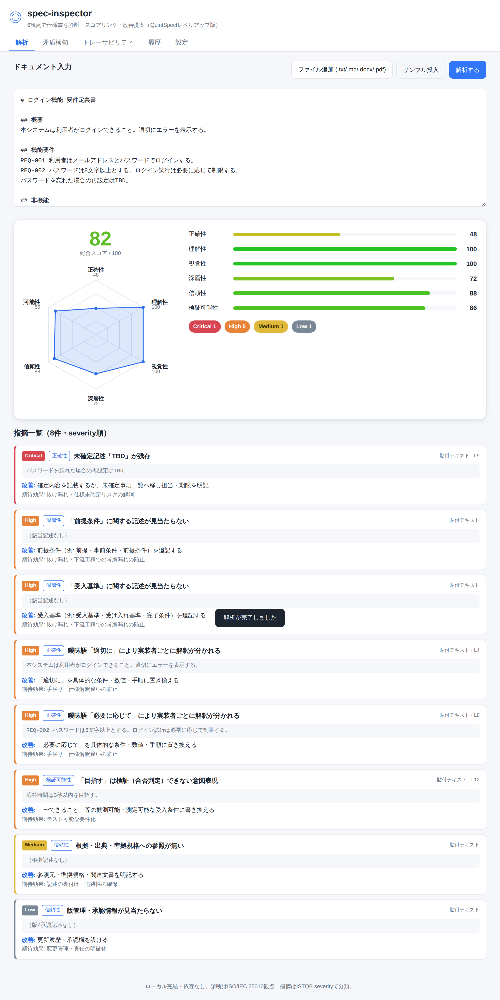

# spec-inspector

## 概要

バルテス社「QuintSpect」をレベルアップした、**AI仕様書インスペクションツール**。
要件定義書・設計書などをAIが解析し、品質観点ごとにスコアリング・改善提案・矛盾検知をおこなう。
ブラウザ完結（クライアントサイド）で動作し、APIキーはlocalStorageに保存する。

元システムの調査結果は [`docs/RESEARCH.md`](docs/RESEARCH.md) を参照。

## QuintSpectからの強化点

- 5観点（正確性・理解性・視覚性・深層性・信頼性）に **検証可能性（テスト容易性）** 軸を追加
- 指摘は ISTQB severity（Critical/High/Medium/Low）＋ **根拠引用（evidence-only）** で提示
- レーダーチャート＋ヒートマップ＋**履歴スコア比較**
- 文書間矛盾検知＋**要件↔設計↔テスト観点トレーサビリティ**
- 改善提案に加え **修正後ドラフト（before/after差分）** を生成

## セットアップ

```bash
# ブラウザ完結のため追加インストール不要（静的配信のみ）
# ローカル確認例:
python3 -m http.server 8000
```

## 使い方

```bash
# ブラウザで index.html を開く（またはローカルサーバ経由でアクセス）
# 1.（任意）設定タブでエンジン/APIキーを選択。既定はルールベース（キー不要）
# 2. 「サンプル投入」またはテキスト貼付／ファイル追加（.txt/.md/.docx/.pdf）
# 3.「解析する」→ 6観点スコア・レーダー・指摘一覧（severity＋根拠＋改善案）を表示
# 4. 2文書以上で「矛盾検知」「トレーサビリティ」タブが有効化
```



## 構成

```
spec-inspector/
├── index.html            # SPA（解析/矛盾検知/トレーサビリティ/履歴/設定）
├── css/style.css
├── src/
│   ├── engine.js         # 6観点ルールベース解析（純粋関数）
│   ├── consistency.js    # 文書間の不一致・矛盾検知
│   ├── traceability.js   # 要件↔設計↔テスト 矩阵
│   ├── parsers.js        # text/md/docx/pdf 抽出（docxはネイティブAPIのみ）
│   ├── history.js        # localStorage履歴・スコア比較
│   ├── llm.js            # LLMアダプタ（既定rule／claude接続は骨組み）
│   ├── charts.js         # 依存なしSVGレーダー・スコアバー
│   └── app.js            # UIオーケストレーション
├── tests/engine.test.mjs # Node単体テスト（`node tests/engine.test.mjs`）
└── docs/RESEARCH.md      # 元QuintSpect調査レポート
```

## テスト

```bash
node tests/engine.test.mjs   # エンジン/矛盾検知/トレーサビリティの単体テスト
```

> ステータス: MVP完成（実ブラウザE2E検証済み・単体テスト13件パス）。詳細は `CURRENT_STATE.md`。

## メモ

- 元QuintSpectは正式版が2026-07-06提供開始（解析予約・履歴管理・通知を追加）。
- 本プロジェクトは学習・検証目的（sandbox配下）。商用サービスの複製ではなく再設計版。
- LLM解析（Claude API補足）は `src/llm.js` に接続口を用意。既定はキー不要のルールベース。
